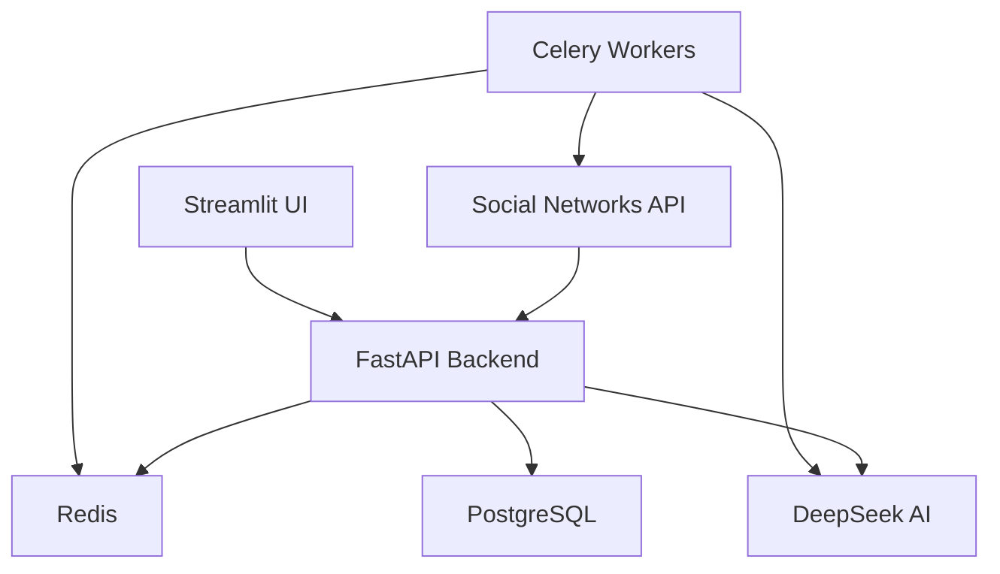

# 🚀 AI-Powered Social Media Manager

<div align="center">

[](https://python.org)
[](https://fastapi.tiangolo.com)
[](https://postgresql.org)
[](LICENSE)

**AI-powered social media analysis and monitoring system**

[Demo](#demo) • [Installation](#installation) • [Usage](#usage) • [Configuration](#configuration)

</div>

## 🎯 Key Value Proposition
An automated social media management and analysis system with AI that transforms raw social media data into actionable insights for businesses and community managers.

## ✨ Features

- 🔐 **Secure Authentication** via OAuth 2.0 (VK, Telegram)
- 🤖 **AI-Powered Content Analysis** using DeepSeek API
- 🔐 **Unified Social Media Management** from a single interface
- 📊 **Comprehensive Analytics** on reach, engagement, and sentiment
- ⚡ **Automated Moderation** of comments and messages
- 🔔 **Smart Notifications** for important events
- 🎯 **Message Classification** for direct messages
- 📈 **Automated Daily Digests**

## 🏗️ Architecture



For a detailed description of the architecture and project structure, please refer to the [Architecture Documentation](./docs/architecture.md).

## 🛠️ Technology Stack

### Backend
- **FastAPI** - High-performance ASGI framework
- **PostgreSQL** - Relational database
- **Redis** - Caching and message broker
- **SQLAlchemy** - ORM for database operations
- **Celery** - Asynchronous task queue

### AI Integration
- **DeepSeek API** - Powerful language model
- **Custom Prompt Engineering** - Fine-tuned prompts

### Frontend
- **Streamlit** - Visualization dashboard
- **Chart.js** - Interactive charts

### Infrastructure
- **Docker** - Application containerization
- **Docker Compose** - Container orchestration
- **Nginx** - Reverse proxy and load balancer

For a complete list of technologies and dependencies, see the [Architecture Documentation](./docs/architecture.md).

## ⚡ Quick Start

### Prerequisites

- Docker 20.10+
- Docker Compose 2.0+
- Python 3.10+ (for development)
- PostgreSQL 14+

### Installation

1. **Clone the repository**
```bash
git clone https://github.com/Starck43/social-media-ai.git
cd social-media-ai

# Install dependencies
pip install -r requirements.txt

# Start the application with Docker
docker-compose up --build
```

### Development

For detailed development setup, testing and migration instructions, please refer to the [Development Guide](./docs/architecture.md#development) in our architecture documentation.

## 🔧 Configuration

1. **Environment Setup**
   ```bash
   cp .env.example .env
   # Edit the .env file with your API keys
   ```

2. **Running the Application**
   ```bash
   docker-compose up -d
   ```

3. **Access Services**
   - `http://localhost:8501` - Streamlit dashboard
   - `http://localhost:8000` - FastAPI API + documentation
   - `http://localhost:8000/docs` - Interactive API documentation
   - `http://localhost:8080` - pgAdmin (if enabled)

### Environment Variables

For a complete list of configuration options and their descriptions, see the [Configuration Section](./docs/architecture.md#configuration) in the architecture documentation.

### Social Media Setup

1. **VKontakte**
   - Create an application on [VK Dev](https://dev.vk.com)
   - Set redirect URI: `http://your-domain/api/v1/auth/vk/callback`
   - Get `VK_APP_ID` and `VK_APP_SECRET`

2. **Telegram**
   - Create a bot via [@BotFather](https://t.me/BotFather)
   - Get your `TELEGRAM_BOT_TOKEN`

3. **DeepSeek**
   - Sign up at [DeepSeek](https://platform.deepseek.com/)
   - Get your API key and set it as `DEEPSEEK_API_KEY` in your `.env` file

## 🚀 Usage

For detailed API documentation and usage examples, please refer to the [API Documentation](./docs/architecture.md#api-endpoints) in our architecture guide.

## 🧪 Development

### Local Development Setup

For setting up a local development environment, running tests, and contributing to the project, please see the [Development Guide](./docs/architecture.md#development) in our architecture documentation.

## 📁 Project Structure

For a detailed breakdown of the project structure, please refer to the [Project Structure](./docs/architecture.md#project-structure) section in the architecture documentation.

## 🤝 Contributing

We welcome contributions! Here's how you can help:

1. Fork the repository
2. Create a feature branch (`git checkout -b feature/amazing-feature`)
3. Commit your changes (`git commit -m 'Add some amazing feature'`)
4. Push to the branch (`git push origin feature/amazing-feature`)
5. Open a Pull Request

For more detailed contribution guidelines, please see our [Contribution Guide](./CONTRIBUTING.md).

## 📄 License

This project is licensed under the MIT License - see the [LICENSE](LICENSE) file for details.

## ⚠️ Disclaimer

This project is intended for educational and research purposes. Please use it in compliance with the terms of service of the social networks you're integrating with. The developers are not responsible for any misuse.

## 🆘 Support

If you encounter any issues or have questions:

1. Check the [documentation](./docs/)
2. Open an [issue](https://github.com/your-username/social-media-ai/issues)
3. Email us at: support@your-domain.com

---

<div align="center">

**Built with ❤️ and Python**

[Report Bug](https://github.com/your-username/social-media-ai/issues) • [Request Feature](https://github.com/your-username/social-media-ai/issues)

</div>
