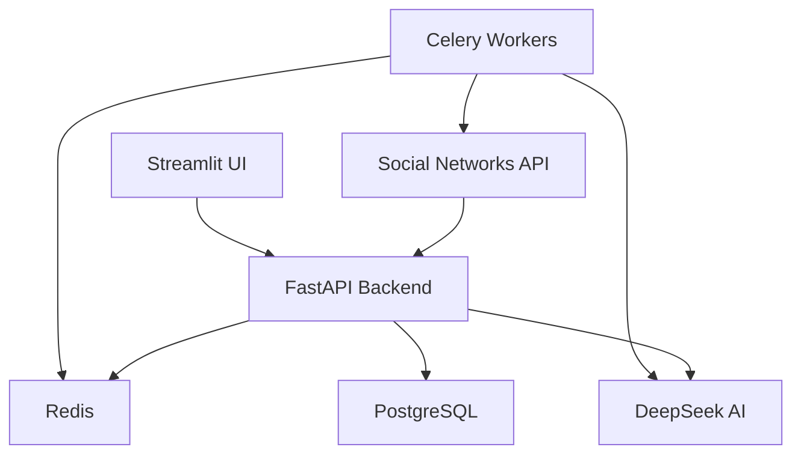

# Social Media AI Analytics

**Сервис мониторинга и анализа активности в социальных сетях с использованием AI.**

<div align="center">

[](https://python.org)
[](https://fastapi.tiangolo.com)
[](https://postgresql.org)
[](LICENSE)


[Demo](#demo) • [Installation](#installation) • [Usage](#usage) • [Configuration](#configuration)

</div>

## 🎯 Основные задачи

- **Мониторинг активности** в VK и Telegram по выбранным источникам (пользователи, группы, чаты, каналы)
- **AI-анализ контента** - определение тем, настроения, активности без хранения сырых данных
- **Автоматическое комментирование** через AI-бота в чатах/группах где есть права модератора
- **Ежедневные отчеты** - краткая выжимка активности с рассылкой на email или в свой канал в telegram/max
- **Единый интерфейс** для просмотра статистики и аналитики

## 🏗️ Архитектура

┌─────────────────┐
│   Scheduler     │ ← Планировщик (Celery Beat/APScheduler)
└────────┬────────┘
         │ запускает по расписанию
         ▼
┌─────────────────┐     ┌─────────────────┐
│  Collectors     │────▶│  VK/Telegram    │
│  (парсеры)      │     │  API            │
└────────┬────────┘     └─────────────────┘
         │ сырой контент
         ▼
┌─────────────────┐
│  AI Analyzer    │────▶ DeepSeek/GPT API
│  (анализ)       │
└────────┬────────┘
         │ метаданные, темы, sentiment
         ▼
┌─────────────────┐     ┌─────────────────┐
│  PostgreSQL     │     │  Bot Executor   │────▶ Комментирование
│  (аналитика)    │     │  (автоответы)   │
└────────┬────────┘     └─────────────────┘
         │
         ▼
┌─────────────────┐
│  Reporter       │────▶ Email/Telegram
│  (отчеты)       │
└────────┬────────┘
         │
         ▼
┌─────────────────┐
│  Streamlit UI   │────▶ Пользователь
└─────────────────┘


```mermaid
graph TB
    A[Social Networks API] --> B[FastAPI Backend]
    B --> C[DeepSeek AI]
    B --> D[PostgreSQL]
    B --> E[Redis]
    F[Streamlit UI] --> B
    G[Celery Workers] --> E
    G --> A
    G --> C
```

For a detailed description of the architecture and project structure, please refer to the [Documentation Index](./docs/DOCS_INDEX.md).

## 🛠️ Technology Stack

### Backend
- **FastAPI** - веб-интерфейс и API
- **PostgreSQL** - хранение аналитики и настроек
- **SQLAlchemy** - ORM for database operations
- **Redis** - Caching and message broker
- **Celery** - фоновые задачи (мониторинг, анализ, рассылка)
- **AI Models** - анализ текста, определение тем, sentiment analysis

### AI Integration
- **DeepSeek API** - Powerful language model
- **Custom Prompt Engineering** - Fine-tuned prompts

### Frontend
- **Streamlit** - Visualization dashboard
- **Chart.js** - Interactive charts

### Infrastructure
- **Docker** - Application containerization
- **Docker Compose** - Container orchestration
- **Nginx** - Reverse proxy and load balancer

### Ключевые таблицы БД
- `platforms` - платформы (VK, Telegram) - секреты в env
- `sources` - источники контента (пользователи, группы, чаты, каналы)
- `ai_analytics` - результаты AI анализа (настроение, темы, активность)
- `bot_scenarios` - сценарии для автоматического комментирования
- `notifications` - системные уведомления для администраторов

For a complete list of technologies and dependencies, see the [Documentation Index](./docs/DOCS_INDEX.md).

## ⚡ Quick Start

### Prerequisites

- Docker 20.10+
- Docker Compose 2.0+
- Python 3.10+ (for development)
- PostgreSQL 14+

### Installation

1. **Clone the repository**
```bash
git clone https://github.com/Starck43/social-media-ai.git
cd social-media-ai

# Install dependencies
pip install -r requirements.txt

# Start the application with Docker
docker-compose up --build
```

### Development

For detailed development setup, testing and migration instructions, please refer to the [Documentation Index](./docs/DOCS_INDEX.md).

## 🔧 Configuration

1. **Environment Setup**
   ```bash
   cp .env.example .env
   # Edit the .env file with your API keys
   ```

2. **Running the Application**
   ```bash
   docker-compose up -d
   ```

3. **Access Services**
   - `http://localhost:8501` - Streamlit dashboard
   - `http://localhost:8000` - FastAPI API + documentation
   - `http://localhost:8000/docs` - Interactive API documentation
   - `http://localhost:8080` - pgAdmin (if enabled)

### Environment Variables

For a complete list of configuration options and their descriptions, see the [Documentation Index](./docs/DOCS_INDEX.md).

### Social Media Setup

1. **VKontakte**
   - Create an application on [VK Dev](https://dev.vk.com)
   - Set redirect URI: `http://your-domain/api/v1/auth/vk/callback`
   - Get `VK_APP_ID` and `VK_APP_SECRET`

2. **Telegram**
   - Create a bot via [@BotFather](https://t.me/BotFather)
   - Get your `TELEGRAM_BOT_TOKEN`

3. **DeepSeek**
   - Sign up at [DeepSeek](https://platform.deepseek.com/)
   - Get your API key and set it as `DEEPSEEK_API_KEY` in your `.env` file

## 🚀 Usage

For detailed API documentation and usage examples, please refer to the [Documentation Index](./docs/DOCS_INDEX.md).

## 🧪 Development

### Local Development Setup

For setting up a local development environment, running tests, and contributing to the project, please see the [Documentation Index](./docs/DOCS_INDEX.md).

## 📁 Project Structure

For a detailed breakdown of the project structure, please refer to the [Documentation Index](./docs/DOCS_INDEX.md).

## 🤝 Contributing

We welcome contributions! Here's how you can help:

1. Fork the repository
2. Create a feature branch (`git checkout -b feature/amazing-feature`)
3. Commit your changes (`git commit -m 'Add some amazing feature'`)
4. Push to the branch (`git push origin feature/amazing-feature`)
5. Open a Pull Request

For more detailed contribution guidelines, please see our [Contribution Guide](./CONTRIBUTING.md).

## 📄 License

This project is licensed under the MIT License - see the [LICENSE](LICENSE) file for details.

## ⚠️ Disclaimer

This project is intended for educational and research purposes. Please use it in compliance with the terms of service of the social networks you're integrating with. The developers are not responsible for any misuse.

## 🆘 Support

If you encounter any issues or have questions:

1. Check the [documentation](./docs/)
2. Open an [issue](https://github.com/your-username/social-media-ai/issues)
3. Email us at: support@your-domain.com

---

<div align="center">

**Built with ❤️ and Python**

[Report Bug](https://github.com/your-username/social-media-ai/issues) • [Request Feature](https://github.com/your-username/social-media-ai/issues)

</div>
