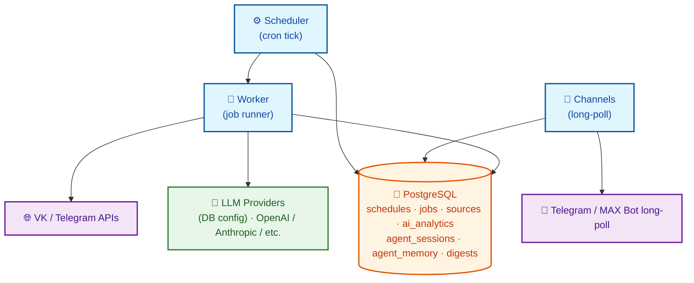

# Social Media AI Analytics

**Персональный AI-агент для мониторинга активности в социальных сетях с доставкой отчётов прямо в мессенджер.**

<div align="center">

[](https://python.org)
[](https://fastapi.tiangolo.com)
[](https://postgresql.org)
[](LICENSE)

[Features](#-features) • [Architecture](#-architecture) • [Quick Start](#-quick-start) • [Usage](#-usage) • [Docs](#-documentation)

</div>

## ✨ Features

- 💬 **Чат с агентом в Telegram / MAX** — один общий бот обслуживает всех пользователей; каждый чат живёт в изолированном
  workspace (multi-tenancy). Агент слушает команды, запоминает факты, подтверждает опасные действия.
- 🧠 **Обучение в чате** — агент извлекает устойчивые предпочтения из вашей переписки и подмешивает их в системный
  промпт. Всё прозрачно: `/good` и `/bad <заметка>` для оценки ответов, `/memory clear` — стереть выученное.
- 🔄 **Гибридный сбор по расписанию** — VK по API, Telegram по Bot API (L1) или по авторизованной MTProto-сессии
  (L2, Telethon). Слой выбирается на источнике, секреты лежат в зашифрованном волте, повторы отсекаются до вызова LLM.
- 🧠 **AI-анализ контента** — определение тем, тональности, вовлечённости без хранения сырых данных. Поддержка
  OpenAI-совместимых и Anthropic провайдеров, настраиваемых через админку.
- 🤖 **Действия бота по правилам** — триггеры (ключевые слова, упоминания, порог тональности) решают *без* LLM, модель
  только пишет текст. Guards (лимит в час, cooldown, чёрный/белый списки) и **dry-run по умолчанию**: действие
  готовится и попадает в леджер, но не публикуется, пока вы не подтвердите его в чате.
- 📊 **Ежедневные и недельные дайджесты** — агрегированная выжимка активности с кратким LLM-саммари, автоматически
  рассылаемая в настроенный канал Telegram/MAX.
- 🏢 **Multi-tenancy из коробки** — один бот, много workspace. Каждый клиент получает изолированные данные через
  invite-коды.
- 🔌 **Любой LLM-провайдер** — добавляйте провайдеров через админку: OpenAI, DeepSeek, Anthropic, Ollama, OpenRouter,
  Groq, vLLM и любой OpenAI-совместимый API. Ключи шифруются Fernet в БД.

## 🏗️ Architecture

Один процесс (`python -m app.runtime`) совмещает три цикла:

```mermaid
  flowchart TB
      S["⚙️ Scheduler<br/>(cron tick)"]
      W["🔨 Worker<br/>(job runner)"]
      C["📡 Channels<br/>(long-poll)"]
  
      DB[("🐘 PostgreSQL<br/>schedules · jobs · sources · ai_analytics<br/>agent_sessions · agent_memory · digests")]
  
      API["🌐 VK / Telegram APIs"]
      BOT["🤖 Telegram / MAX Bot long-poll"]
      LLM["🧠 LLM Providers<br/>(DB config) · OpenAI / Anthropic / etc."]
  
      S --> W
      W --> DB
      C --> DB
      S --> DB
  
      W --> API
      W --> LLM
      C --> BOT
  
      classDef runtime fill:#e1f5ff,stroke:#01579b,stroke-width:2px,color:#0d47a1
      classDef storage fill:#fff4e1,stroke:#e65100,stroke-width:2px,color:#bf360c
      classDef external fill:#f3e5f5,stroke:#6a1b9a,stroke-width:2px,color:#4a148c
      classDef llm fill:#e8f5e9,stroke:#2e7d32,stroke-width:2px,color:#1b5e20
  
      class S,W,C runtime
      class DB storage
      class API,BOT external
      class LLM llm
```

Ключевые решения:

- **Без Celery и Redis в runtime.** Очередь задач и cron реализованы на PostgreSQL (`agent_tasks` + `jobs` +
  `SELECT ... FOR UPDATE SKIP LOCKED`). Один VPS, один оператор — лишние сущности не нужны.
- **Long polling для мессенджеров.** Публичный URL, домен и TLS-сертификат не требуются — бот опрашивает `getUpdates` /
  `GET /updates`.
- **Общий бот — изолированные данные.** Multi-tenancy на уровне запросов: `TenantScopedMixin` фильтрует каждую выборку
  по `current_tenant_id()`. См. [`docs/TENANCY.md`](./docs/TENANCY.md).
- **LLM в БД, не в коде.** Провайдеры и модели хранятся в `llm_providers` / `llm_models`, ключи шифруются Fernet.
  Добавление нового провайдера — строка в админке.

Подробное описание: [`docs/AGENT.md`](./docs/AGENT.md), [`docs/AGENT_TASKS.md`](./docs/AGENT_TASKS.md), [`docs/DIGEST.md`](./docs/DIGEST.md).

## 🛠️ Technology Stack

### Runtime

- **Python 3.12+**
- **FastAPI** — HTTP API и админка (sqladmin)
- **SQLAlchemy 2.0** + **Alembic** — ORM и миграции
- **PostgreSQL 14+** — единственное хранилище и очередь задач
- **httpx** — HTTP-клиент для LLM и соцсетей

### AI / Agent

- **Два LLM-клиента**: OpenAI-совместимый (DeepSeek, OpenAI, Ollama, OpenRouter, Groq, vLLM) и Anthropic (Claude).
  Настраиваются через админку, ключи шифруются Fernet.
- **Persistent memory** — факты пользователя живут в `agent_memory` между сессиями.
- **Confirmation flow** — опасные действия (изменение расписаний, отправка дайджеста) требуют явного «да» от владельца
  workspace.

### Messenger channels

- **Telegram Bot API** (long polling, `getUpdates + offset`)
- **MAX Bot API** (long polling, `GET /updates + marker`)
- Общий бот на все workspace, маршрутизация через `tenant_channels`.

### Infrastructure

- **Docker** + **Docker Compose**
- Без внешнего брокера сообщений, без reverse proxy для мессенджеров.

### Ключевые таблицы БД

| Таблица                                            | Назначение                                |
|----------------------------------------------------|-------------------------------------------|
| `tenants`, `tenant_users`, `tenant_channels`       | workspace-ы и привязка чатов              |
| `sources`                                          | источники мониторинга (tenant-scoped)     |
| `agent_tasks`, `jobs`                              | cron-расписания и очередь задач           |
| `ai_analytics`                                     | результаты AI-анализа + токены/стоимость  |
| `agent_sessions`, `agent_messages`, `agent_memory` | диалог и память агента                    |
| `digest_runs`                                      | идемпотентная история отправок дайджестов |
| `llm_providers`, `llm_models`                      | настройки LLM-провайдеров (глобальные)    |
| `user_credentials`                                 | личные L2-секреты (VK user_token, TG session), Fernet |

Полный список схем — в [`docs/`](./docs/).

## ⚡ Quick Start

### Prerequisites

- Docker 20.10+ и Docker Compose 2.0+ **или**
- Python 3.12+ и PostgreSQL 14+

### 1. Клонировать и установить

```bash
git clone https://github.com/Starck43/social-media-ai.git
cd social-media-ai
pip install -r requirements.txt
```

### 2. Настроить окружение

```bash
cp .env.example .env
```

**Обязательно заполнить:**
- `POSTGRES_URL` — PostgreSQL DSN
- `CREDENTIALS_KEY` — Fernet-ключ для шифрования LLM-ключей
- `TELEGRAM_BOT_TOKEN` — получить у `@BotFather`
- Опционально: `MAX_BOT_TOKEN`, `MAX_API_BASE`, `VK_APP_ID`/`VK_APP_SECRET`

Сгенерировать `CREDENTIALS_KEY`:

```bash
python -c "from cryptography.fernet import Fernet; print(Fernet.generate_key().decode())"
```

### 3. Запустить

```bash
alembic upgrade head
python -m app.runtime
```

> Runtime запустит task runner, worker и Telegram/MAX listener в одном процессе.

### 4. Добавить LLM-провайдера

Через админку (`uvicorn app.main:app` → `/admin`):

1. Создать провайдера:
   - **Name:** `deepseek`
   - **API format:** `openai`
   - **Base URL:** `https://api.deepseek.com`
   - **Auth header:** `Authorization`
   - **API key:** ключ из кабинета DeepSeek (сохранится зашифрованным)
2. Отметить как **default**
3. Добавить модель: имя `deepseek-chat`, type `text`, задать стоимость за 1K токенов

Агент автоматически подхватит первую активную text-модель.

### 5. Первый чат

1. Написать своему боту в Telegram
2. Первое сообщение автоматически привяжет чат к bootstrap-workspace владельца
3. `/help` — список команд

Дальше через обычные сообщения или команды: добавить источник, настроить расписание, посмотреть аналитику.

**Пригласить коллег:** бот выдаст invite-код, который привяжет их чат к отдельному workspace.

### 6. Дайджест

```bash
python -m cli.main digest send-now day     # разовая отправка
python -m cli.main task add weekly-digest "0 9 * * 1" digest -p '{"period": "week"}'
```

Или настроить через чат с агентом (он подтвердит опасные действия).


## 🔧 Configuration

### Environment variables

| Переменная                        | Назначение                                          |
|-----------------------------------|-----------------------------------------------------|
| `POSTGRES_URL`                    | PostgreSQL DSN (полный URL)                          |
| `CREDENTIALS_KEY`                 | Fernet-ключ для шифрования секретов в БД             |
| `DEFAULT_TENANT_SLUG`             | slug bootstrap workspace (по умолчанию `owner`)      |
| `TELEGRAM_BOT_TOKEN`              | токен Telegram-бота                                 |
| `TELEGRAM_DIGEST_CHANNEL_ID`      | канал для отправки дайджестов                       |
| `TELEGRAM_OWNER_IDS`              | comma-separated Telegram user ids, которым разрешён чат с агентом |
| `TELEGRAM_API_ID`                 | L2 (MTProto) app id; предпочтительно через `credentials login telegram` в vault |
| `TELEGRAM_API_HASH`               | L2 (MTProto) app hash (legacy fallback)          |
| `TELEGRAM_SESSION`                | L2 (MTProto) `StringSession` — full-access, не коммитить (legacy fallback) |
| `MAX_BOT_TOKEN`                   | токен MAX-бота                                      |
| `MAX_CHANNEL_ID`                  | канал для отправки дайджестов (MAX)                 |
| `MAX_API_BASE`                    | base URL для MAX Bot API (по умолчанию `https://platform-api2.max.ru`) |
| `SCHEDULER_ENABLED`               | включить cron-планировщик (по умолчанию `true`)     |
| `SCHEDULER_TIMEZONE`              | часовой пояс cron по умолчанию (зона воркспейса важнее) |
| `AGENT_MODEL`                     | явная модель для агента (иначе первая активная)      |
| `AGENT_DAILY_COST_LIMIT`          | USD-потолок за день: агент + дайджесты (по умолчанию 5.0) |
| `AGENT_MAX_ITERATIONS`            | макс. раундов tool-call на сообщение (по умолч. 6)  |
| `AGENT_HISTORY_LIMIT`             | глубина истории в контексте агента (по умолч. 20)   |
| `AGENT_MAX_TOKENS`                | макс. токенов в ответе агента (по умолч. 1024)      |
| `AGENT_TEMPERATURE`               | temperature для ответов агента (по умолч. 0.4)      |

> Секреты соцсетей (`VK_*`) по-прежнему живут в env. LLM-ключи — в БД, зашифрованные Fernet.

## 🚀 Usage

### Чат с агентом

- `/help` — список команд
- `/stop` — очистить историю диалога
- Обычные сообщения — агент использует инструменты: `sources_list`, `task_add`, `collect_now`, `report_period`, `memory_set`/`memory_get`, `digest_send_now` и др.
- Опасные действия — складываются в `pending_confirmation`, ждут явного «да»/«нет».

### CLI

```bash
python -m cli.main task list
python -m cli.main task add hourly-collect "0 * * * *" collect -p '{"source_id": 1}'
python -m cli.main task pause weekly-digest
python -m cli.main digest send-now day
```

## 🧪 Development

```bash
pip install -r requirements.txt
alembic upgrade head
pytest
```

Тесты идут в отдельной схеме `DB_TEST_SCHEMA` (по умолчанию `test_schema`) —
рабочие данные не затрагиваются никогда. Отдельная база `TEST_POSTGRES_URL`
необязательна: она даёт второй уровень изоляции, но требует права `CREATEDB`.
`tests/conftest.py` разворачивает процесс на тестовую схему до первого импорта
`app`, а `scripts/setup_test_db.py` при первом запуске сам создаёт схему, таблицы
и сиды (роли, permissions, платформы, bootstrap-воркспейс) — повторные запуски
идемпотентны. Скрипт откажется работать, если цель совпадёт с рабочей базой **и**
рабочей схемой одновременно.

```bash
pytest                                  # схема создастся сама
python -m scripts.setup_test_db --check # какая база и схема будут использованы
python -m scripts.setup_test_db --reset # очистить всё и пересеять
```

Тесты, требующие данных, которых нет в сидах, создают их сами.

## 📚 Documentation

Полный список схем — в [`docs/`](./docs/):
[AGENT](./docs/AGENT.md) · [AGENT_TASKS](./docs/AGENT_TASKS.md) · [DIGEST](./docs/DIGEST.md) · [COLLECTION](./docs/COLLECTION.md) · [TENANCY](./docs/TENANCY.md) · [Analytics](./docs/ANALYTICS_AGGREGATION_SYSTEM.md)

## 📄 License

MIT — см. [`LICENSE`](LICENSE)


<div align="center">

Built with ❤️ and Python
</div>
