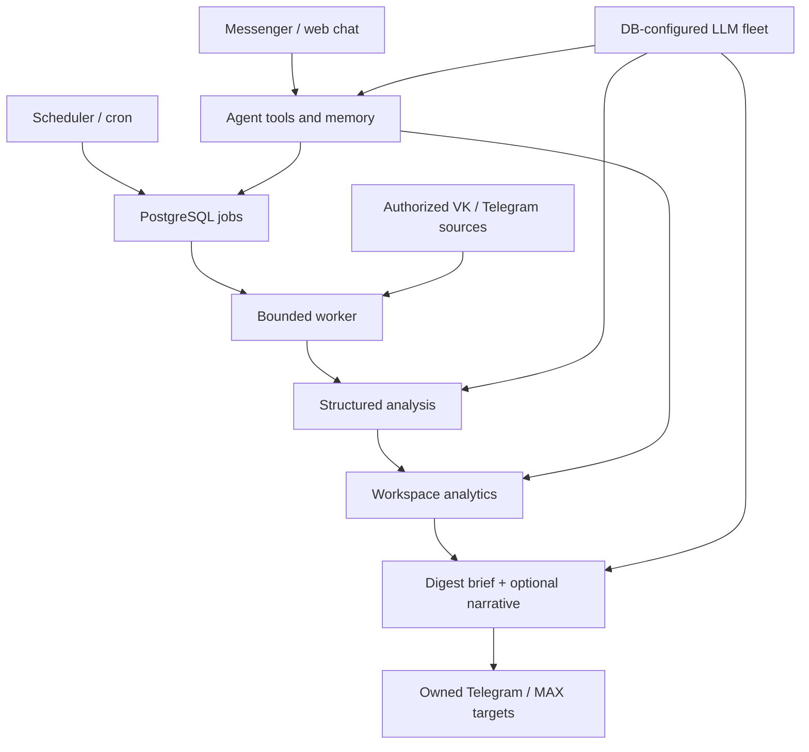

# AI Assistant

**An extensible AI assistant for evidence-backed research and controlled business workflows.**

The project is evolving from social-media monitoring into a universal assistant: find and collect authorized information, analyze it, prepare an actionable result, deliver it on a schedule and help the user follow through. Different businesses use the same process with their own sources, templates, rules and approval policies.

**Current foundation:** VK/Telegram collection, structured AI analysis, Telegram/MAX digests, messenger/web agent chat, persistent memory and isolated workspaces. **Product direction, not yet an availability promise:** web/video research, local-file and email search, unified client communication, CRM/ERP adapters, reminders, deterministic commercial calculations, case history and remote document approvals.

The product is **AI Assistant** (ИИ Ассистент); the repository name remains `social-media-ai`. No technical rename or application feature implementation is included in the product-direction documentation.

[Product plan](docs/PRODUCT_PLAN.md) · [Target architecture](docs/ASSISTANT_ARCHITECTURE.md) · [Quick start](#quick-start) · [Documentation](#documentation)

## Universal process

**Goal → authorized sources → collect/search → verify → analyze/calculate → propose → approve when required → deliver/execute → audit/follow-up.**

Social intelligence, procurement, customer communication and document handling are templates over this process, not separate hard-coded products. The assistant proposes bounded plans; permissions, scheduling, budgets, calculations and risky actions remain controlled by deterministic services and user policy.

## Current capabilities and limits

- **Messenger and web agent:** Telegram/MAX private chat and `/app/chat`, tool calling, persistent sessions, facts/preferences and feedback. `/good`, `/bad <note>` and `/memory clear` expose feedback/memory controls. This is not yet a unified customer inbox.
- **Collection:** VK API/user authorization; Telegram Bot API updates where the bot has access and MTProto history through an authorized personal session. Source-specific collection modes and deduplication reduce repeat analysis. MAX chat/digest transport does not establish MAX collection; web/YouTube/VK Video adapters are future work.
- **Structured analysis:** reusable scenarios define methodology and fields; stored aggregates support reports and analysis navigation. Source metrics are limited by what the collection path actually supplies.
- **Reactions:** deterministic triggers prepare drafts with guards and dry-run defaults. Live publication must remain disabled for the initial pilot until authorization, approval and execution gates pass.
- **Daily/weekly digests:** aggregate-first brief plus optional LLM narrative, delivered to explicitly authorized active workspace channel bindings. Routing isolation exists; durable per-target retry/concurrent-send guarantees remain open.
- **Multi-tenancy:** shared deployment with workspace-scoped data and invitations. Current identity/permission gaps still require hardening before business release.
- **LLM configuration:** OpenAI-compatible and Anthropic API clients, DB-managed providers/models, encrypted API keys, fallback and usage tracking. “Any provider” means one of the supported API formats, not automatic support for every proprietary authentication/API.

Raw monitoring content is staged for analysis, not a permanent archive. Future correspondence/document/case history needs a separately approved retention policy. Current spend tracking is not a complete concurrency-safe billing ledger or a guarantee against all overspend.

**Business production readiness has not been demonstrated by this README.** See [release gates](docs/BUSINESS_PRODUCTION_READINESS.md) and the [readiness-first roadmap](docs/ROADMAP_INTEGRATED.md).

## Planned capability areas

1. **Research and monitoring:** authorized social/web/video sources; findings with references, freshness, coverage and scheduled delivery to channels, email or application.
2. **Personal/business knowledge search:** approved local folders, PDF/Word/Excel, mail and connected apps, with file/page/sheet/message references. Local access requires a paired local connector; no automatic access to a user's disk.
3. **Unified communication:** verified contacts and cross-channel history, recipient/channel suggestions, attachments and an approved scheduled outbox. CRM integrations such as Bitrix24 are optional adapters.
4. **Follow-up and records hygiene:** commitments, birthdays, non-repeating greeting proposals based on available history, supplier-update reminders and reviewable archive/deletion suggestions.
5. **Calculations and cases:** sourced prices, unit/currency/tax normalization, deterministic quantities/cost-per-area, quotations and a configurable case from request to delivery. 1C/Excel/Word are potential inputs, not mandatory dependencies.
6. **Documents and approvals:** business letters, claims/responses and versioned remote approval. Legally recognized signatures require an appropriate provider and jurisdiction-specific review; a chat confirmation is not automatically a legal signature.

These are planned modules, not shipped features. Implement one validated workflow at a time after safety gates. Details, dependencies and acceptance evidence: [PRODUCT_PLAN](docs/PRODUCT_PLAN.md).

## Architecture

`python -m app.runtime` combines scheduler, worker and Telegram/MAX long-poll listener. PostgreSQL stores schedules, jobs, workspace data, analysis, agent history and delivery bookkeeping.


```mermaid
flowchart TB
    Scheduler[Scheduler / cron] --> Jobs[PostgreSQL jobs]
    Jobs --> Worker[Bounded worker]
    Sources[Authorized VK / Telegram sources] --> Worker
    Worker --> Analysis[Structured analysis]
    Analysis --> Data[Workspace analytics]
    Data --> Digest[Digest brief + optional narrative]
    Digest --> Targets[Owned Telegram / MAX targets]
    Chat[Messenger / web chat] --> Agent[Agent tools and memory]
    Agent --> Jobs
    Agent --> Data
    Models[DB-configured LLM fleet] --> Analysis
    Models --> Agent
    Models --> Digest
```

- **No Celery/Redis dependency in the active runtime:** PostgreSQL `agent_tasks`/`jobs` and job claiming via `FOR UPDATE SKIP LOCKED`. Legacy Celery/Redis/Streamlit code is frozen, not deleted.
- **Long polling:** messenger bots do not require a public webhook URL. Optional web UI/API and OAuth callbacks have separate deployment requirements.
- **Scoped delivery:** only active owned DB bindings authorize workspace sends; deprecated env destination IDs are ignored. Fixed operator alerts are separate.
- **Methodology versus execution:** scenario = analysis lens; task = schedule/sources/reaction/targets; grouping = read-time projection.
- **Measured evolution:** start with a modular application and PostgreSQL; separate workers, add storage/indexing or resilient infrastructure when workload/security/recovery evidence justifies it. No immediate microservice rewrite.

See [AGENT](docs/AGENT.md), [AGENT_TASKS](docs/AGENT_TASKS.md), [DIGEST](docs/DIGEST.md), [TENANCY](docs/TENANCY.md) and [target architecture](docs/ASSISTANT_ARCHITECTURE.md).

## Technology stack

Python 3.12+, FastAPI, SQLAlchemy 2.0, Alembic, PostgreSQL 14+, httpx and Docker Compose. Optional sqladmin/API; client web UI uses Jinja2 with HTMX/Alpine/Tailwind. LLM credentials are encrypted with Fernet under `CREDENTIALS_KEY`.

Core tables: `tenants`, `tenant_users`, `tenant_channels`, `sources`, `agent_tasks`, `jobs`, `ai_analytics`, `agent_sessions`, `agent_messages`, `agent_memory`, `digest_runs`, `llm_providers`, `llm_models`, `user_credentials`. Proposed contact/case/workflow/outbox concepts are **not existing schema promises**.

## Quick start

### Prerequisites

Python 3.12+ and PostgreSQL 14+, or a reviewed Docker/Compose setup. Read [deployment](docs/DEPLOYMENT.md) and [production readiness](docs/BUSINESS_PRODUCTION_READINESS.md) before hosting a business service; examples alone are not a tested production profile.

### 1. Install

```bash
git clone https://github.com/Starck43/social-media-ai.git
cd social-media-ai
git checkout dev
python -m venv .venv
# Activate .venv using the command for your shell.
pip install -r requirements.txt
cp .env.example .env
```

Never commit secret environment files, API keys or sessions.

### 2. Configure

Set `POSTGRES_URL` and `CREDENTIALS_KEY`; configure `TELEGRAM_BOT_TOKEN` if using Telegram. MAX and VK configuration are optional. An unconfigured integration must not prevent the application from starting, but its capabilities will be unavailable.

```bash
python -c "from cryptography.fernet import Fernet; print(Fernet.generate_key().decode())"
```

Personal VK tokens and Telegram MTProto sessions use the encrypted vault; app/bot credentials are deployment configuration with documented fallback rules. See [COLLECTION](docs/COLLECTION.md), rather than assuming all social secrets live in env.

### 3. Migrate and start

From the repository root:

```bash
alembic upgrade head
python -m app.runtime
```

Optional API/admin process:

```bash
uvicorn app.main:app
```

Runtime already includes a worker. Do not accidentally start duplicate scheduler/listener owners. Worker-only operation is `python -m app.worker`.

### 4. Configure an LLM

Through the operator admin (`/admin`), create a provider, choose `openai` or `anthropic`, set its correct base URL/authentication and API key, then add an active text model with its actual API model ID and tariffs. Mark the intended provider/model defaults. Example: an OpenAI-compatible DeepSeek provider with `https://api.deepseek.com` and `deepseek-chat`.

Keys are encrypted on save. Unknown tariffs must not be treated as proof of free usage. Default/quality/cost-efficient resolution and fallback behavior are described in [AGENT](docs/AGENT.md) and repository guidance.

### 5. Start a chat and configure sources

Use the configured bot and `/help`. Configure allowed owner identities and workspace membership/invites deliberately; do not rely on legacy unresolved-user bypass as production authorization. Add authorized sources, a scenario and a schedule. Optional web chat shares the agent runtime.

### 6. Configure delivery

Register each intended recipient as an **active owned workspace channel binding** and enable `is_digest_target` in workspace Channels settings. `TELEGRAM_DIGEST_CHANNEL_ID` and `MAX_CHANNEL_ID` are deprecated/ignored; the operator admin chat is not a digest recipient. Unscoped manual operator runs build only the bootstrap workspace's digest.

```bash
python -m cli.main digest send-now day
python -m cli.main task add weekly-digest "0 9 * * 1" digest -p '{"period": "week"}'
```

See [delivery configuration](docs/DIGEST.md#configuration). Manual sends are separate runs; do not mistake them for an exactly-once retry guarantee.

## Configuration

| Variable | Purpose |
| --- | --- |
| `POSTGRES_URL` | PostgreSQL DSN |
| `CREDENTIALS_KEY` | Vault/LLM-key encryption key; protect and back it up separately |
| `DEFAULT_TENANT_SLUG` | Bootstrap workspace slug (default `owner`) |
| `TELEGRAM_BOT_TOKEN`, `MAX_BOT_TOKEN` | Shared messenger bot credentials |
| `TELEGRAM_OWNER_IDS` | Allowed Telegram owner identities |
| `TELEGRAM_API_ID`, `TELEGRAM_API_HASH`, `TELEGRAM_SESSION` | Legacy MTProto env fallback; personal vault login preferred |
| `MAX_API_BASE` | MAX transport endpoint; see current configuration reference |
| `TELEGRAM_DIGEST_CHANNEL_ID`, `MAX_CHANNEL_ID` | Deprecated; ignored by digest delivery |
| `SCHEDULER_ENABLED`, `SCHEDULER_TIMEZONE` | Scheduler switch and fallback timezone; workspace timezone takes priority |
| `AGENT_MODEL` | Explicit configured model name |
| `AGENT_DAILY_COST_LIMIT` | Current daily agent/digest/learning spend policy; not yet complete analysis/concurrency accounting |
| `AGENT_MAX_ITERATIONS`, `AGENT_HISTORY_LIMIT` | Bounded tool loop and context history |
| `AGENT_MAX_TOKENS`, `AGENT_TEMPERATURE` | Chat generation settings |

For defaults and the complete list, use [CONFIGURATION](docs/CONFIGURATION.md) and `.env.example`.

## Usage

- `/help`: commands and available tools.
- `/stop`: clear dialog history, keeping the session.
- `/good`, `/bad <note>`: feedback.
- `/memory clear`: clear learned facts under existing owner controls.
- Natural-language requests use source/task/report/scenario/memory tools; write tools may stage confirmation. Confirmation alone is not sufficient authorization.

```bash
python -m cli.main task list
python -m cli.main task add hourly-collect "0 * * * *" collect -p '{"source_id": 1}'
python -m cli.main task pause weekly-digest
python -m cli.main digest send-now day
python -m cli.main credentials list --user <id>
python -m cli.main credentials login telegram --user <id>
```

## Development and validation

```bash
pip install -r requirements.txt
alembic upgrade head
python -m scripts.setup_test_db --check
pytest
```

Tests use `DB_TEST_SCHEMA` (default `test_schema`); `TEST_POSTGRES_URL` provides additional database isolation when configured. `tests/conftest.py` switches to the test schema before importing the application; `scripts/setup_test_db.py` provisions test fixtures and refuses a target matching both working DB and schema. Verify the actual resolved test target; never run destructive setup on production.

```bash
python -m scripts.setup_test_db --reset  # destructive: isolated test target only
```

Keep implementation changes in thematic branches from fresh dev; recheck parallel edits before merge and report exact tested revisions. Direct documentation saving to dev in this update was explicitly requested by the owner and is not a change to the normal implementation policy. Do not run a repository-wide reformat. Schema changes need their own reviewed migration plan.

## Documentation

Start at [DOCS_INDEX](docs/DOCS_INDEX.md).

- Direction: [vision](docs/design/vision.md), [product plan](docs/PRODUCT_PLAN.md), [target architecture](docs/ASSISTANT_ARCHITECTURE.md).
- Release order: [integrated roadmap](docs/ROADMAP_INTEGRATED.md), [business readiness](docs/BUSINESS_PRODUCTION_READINESS.md), [future scale strategy](docs/design/future_scale_strategy.md).
- Runtime: [agent](docs/AGENT.md), [tasks](docs/AGENT_TASKS.md), [digests](docs/DIGEST.md), [notifications](docs/NOTIFICATIONS.md), [collection](docs/COLLECTION.md), [tenancy](docs/TENANCY.md).
- References: [API](docs/API.md), [CLI](docs/CLI.md), [models](docs/MODELS.md), [configuration](docs/CONFIGURATION.md), [deployment](docs/DEPLOYMENT.md), [analytics](docs/ANALYTICS_AGGREGATION_SYSTEM.md).

Existing historical reviews retain their baselines. Planned integrations, legal validity and production readiness must not be inferred from roadmap text.
