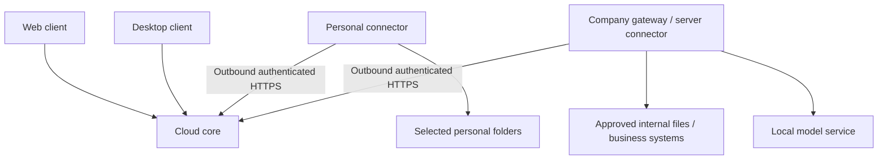

# Deployment architecture v1: cloud and hybrid assistant

## Decision, scope and baseline

Owner-approved direction, 2026-10-09: deliver cloud and hybrid profiles first; support personal-computer and company-server connectors; local models are part of the hybrid design. Fully autonomous installation is a separate later stage. This document is a plan, not an implemented deployment profile or security certification.

Prepared from dev `7a0637412ae761fff83f26fb4f8b5a581dcf6e28`. Read together with [PRODUCT_PLAN](PRODUCT_PLAN.md), [ASSISTANT_ARCHITECTURE](ASSISTANT_ARCHITECTURE.md) and the readiness-first [ROADMAP_INTEGRATED](ROADMAP_INTEGRATED.md). Existing release gates remain binding. No application/schema changes or production operations are authorized by this documentation PR.

## Deployment profiles

| Profile | Topology | Initial scope |
| --- | --- | --- |
| Cloud | Web/Desktop → shared cloud core; optional personal connector | First delivery track; no customer server required |
| Hybrid | Web/Desktop → cloud core ↔ company gateway and optional personal connectors | First delivery track, implemented incrementally after cloud/control safety |
| Private core | Web/Desktop → dedicated company-controlled core and connectors | Future packaging decision; do not promise a release date |
| Autonomous | Core, storage, UI assets, parsers and models entirely inside company network | Separate later stage; no mandatory cloud/license/telemetry connection |

An external core plus company server is hybrid, not fully isolated. Internet-dependent sources remain unavailable in autonomous operation unless an explicitly permitted import/egress mechanism exists.

Arrows from connectors indicate connection initiation, not permission to upload all source content. Desktop must work directly with the cloud without requiring a company gateway. Corporate direct access can be restricted by company policy; personal access must not bypass that restriction.

## Components and placement

- **Cloud core:** identities/workspaces, chat, plan validation, schedules/jobs, approved cloud data, report delivery, auditing and connector routing. Start with the current modular Python/PostgreSQL architecture; no wholesale microservice rewrite.
- **Web client:** primary portable UI, explicit active workspace/source/processing policy, previews, source references, approvals and job/device state.
- **Desktop shell:** optional UI plus personal connector lifecycle and local consent; reuses versioned cloud APIs. UI authentication and device credentials are separate. Desktop framework is not selected by this plan.
- **Connector engine:** shared protocol, capability validation, adapter execution, bounded local state, extraction/search and policy enforcement.
- **Personal profile:** per-user installation/background process, selected folders, visible pause/status, optional autostart; can sleep or disconnect.
- **Company profile:** service/container under a restricted service identity, corporate sources and local model adapters, operator diagnostics and restart policy; intended for continuous availability.
- **Model services:** external authorized providers or local inference reachable only from the approved execution environment. Local models are not exposed as public unauthenticated endpoints.

A device/installation is not a source. One device hosts multiple connections; a workspace may have multiple devices. Each connection has its own owner, scopes, processing policy and stable identifier. Transfer to a replacement server requires an explicit rebind and revocation of the old execution identity.

## Placement and data policies

Recommended defaults accepted for planning, subject to implementation/security review:

1. **Local-only processing:** documents, search index, extracted passages, prompts and model outputs stay inside the company/device boundary. Cloud may receive explicitly approved minimal job status. Show local result content only in an authorized local viewing path; do not route it through cloud chat history.
2. **Selected results/fragments:** local extraction/search; only separately authorized fields, snippets or results go to cloud for further processing. Derived summaries can be confidential too. Policy covers all stages, not merely original file upload.
3. **Approved cloud copies:** chosen objects may be uploaded/indexed under explicit retention, ACL, encryption, export/deletion and geography rules. Never enabled by default for sensitive sources.

A local model does not make a workflow local-only if cloud chat, prompts, audit payloads, embeddings, diagnostics or report delivery expose its contents. Classify all data classes and hops. For strict local-only hybrid work, introduce a company-local result/API/UI path authenticated independently; the cloud stores opaque result references only. Web access to that result requires an authorized network/VPN/local endpoint. Until this path is built, do not advertise local-only results in the cloud UI.

Local-only chat must enter the local path before sensitive text reaches the cloud. If a user pastes private content into cloud chat, connector restrictions cannot undo that upload. Explain this boundary visibly. Encryption in transit or relay encryption does not by itself prove the cloud cannot access content; end-to-end confidentiality requires a separately reviewed key/relay design.

Transfer policy is enforced at the local boundary before egress, and again in cloud storage/model admission. Cloud task arguments cannot widen folder scopes, alter policy, read secrets or authorize forwarding. Use typed field allowlists/size limits and user/admin review; a regex redactor is not a complete leakage defense. Unknown classifications fail closed for external transfer.

## Identity, permissions and secrets

- Separate platform operator, tenant administrator, user, device and external service identities. Pair each installation using a short-lived one-use enrollment flow; issue revocable scoped device credentials, rotate them and log enrollment/revocation.
- Initial cloud authentication uses the application's accounts/roles; corporate SSO is an extension. Source rights remain independent of workspace membership.
- A company service account's broad technical access must never imply every employee can read every file. Either impersonate the authenticated user where supported or enforce explicit source/document ACL mappings. If rights cannot be verified, deny access.
- Filter retrieval/attachments/caches by tenant, actor and source ACL before content reaches models. Revocation must invalidate subsequent access, including queued work and cached results.
- Internal system passwords/tokens remain in a local protected store where possible. Never send them to models, cloud task arguments or diagnostics.
- No unrestricted shell, arbitrary executable/plugin, public file server or cloud-supplied filesystem path. Canonicalize paths, prevent traversal/symlink escapes and sandbox bounded parsers.
- Optional support access is temporary, explicitly approved, least-privileged and audited; no persistent vendor backdoor. No raw documents in default telemetry.

## Connector job protocol

Start with outbound HTTPS long polling; consider a persistent transport only when latency/load measurements justify it. Corporate gateways need not open inbound internet ports. Honor enterprise proxies and verified TLS; do not disable certificate validation.

A versioned job envelope includes tenant, initiating actor, connection/device route, typed operation and arguments, data/processing policy version, allowed result fields, deadline, attempt/run IDs and resource limits. Device authentication is not authorization for any arbitrary user/source named in the envelope.

Requirements:
- validate current local and cloud authorization/policy at execution and result export;
- capability/version negotiation; unsupported operations fail clearly;
- leases/heartbeats, bounded durable checkpoints and admission control;
- retry-safe reads; separate approval/claim/idempotency for writes;
- chunked bounded results with evidence/version/freshness and optional expiry;
- task cancellation/revocation, expired-command rejection and replay protection;
- local restart recovery and cloud reconciliation; quotas on disk/index/parser/model work;
- distinguish pending-device, running, partial, failed, canceled, expired and unknown external outcome.

Do not treat the current PostgreSQL job claim mechanism as a complete distributed connector lease. New protocol/storage must be proposed and tested separately. On disconnect, reads may resume under fresh rights; ambiguous writes require reconciliation rather than blind replay. Old cached results are explicitly stale and remain subject to current access/policy.

## Local and external model routing

The current provider fleet is global and supports OpenAI-compatible/Anthropic formats. It does NOT implement tenant-private routes, local device dispatch or residency-aware fallback. Existing Ollama/vLLM-shaped API compatibility is useful but insufficient for hybrid support. Do not register a private company endpoint in the shared global fleet.

Proposed resolution: required capability + tenant/connection policy + execution location → allowed model routes → health/resource admission → selected model. Filter the allowed set BEFORE fallback. Local-only runs cannot fall back to external inference, cloud embeddings, OCR, speech recognition or a remote vision service. Missing local capability returns a clear unsupported/unavailable state.

Model capability contracts cover text, tool calling, structured outputs, embeddings, vision, OCR/speech where required, context limits and cancellation/timeout behavior. Version/model changes need quality fixtures. Candidate serving technologies include OpenAI-compatible local services such as Ollama/vLLM; exact engines/models/licenses/hardware remain separate decisions.

A cloud model can orchestrate only non-sensitive control metadata in a local-only workflow; reasoning over private content must run locally. If a local model lacks safe tool calling, use a constrained deterministic workflow or declare the capability unsupported, not a hidden external fallback.

Account for external billed attempts AND local compute constraints: concurrency, tokens, memory, timeout, queue length, storage and tenant fairness. Zero API price is not unlimited free execution. The cloud cannot directly call a LAN endpoint; hybrid inference is dispatched through the authorized gateway or another separately reviewed secure route.

## Data lifecycle, maintenance and recovery

Define retention separately for cloud-approved content, local indexes/caches, extraction artifacts, chat, receipts/audit, models and backups. Reapply deletions on restore and invalidate obsolete device credentials. Do not convert monitoring staging into an indefinite raw archive.

Release packages are versioned and signed/verified. Maintain a supported cloud/connector compatibility window; drain jobs before upgrade, rollback safely and avoid automatic schema downgrade. Server profile supports controlled maintenance; personal profile shows update/restart status. Offline packages and bundled UI assets are future autonomous prerequisites.

Back up each required placement independently, including protected keys. Cloud DB recovery alone cannot recover local-only documents/indexes/credentials. Specify RPO/RTO after workload/business requirements; run isolated restore and upgrade drills before promises. A compromised/lost device must be revocable without affecting unrelated tenants/devices.

## Implementation sequence and acceptance gates

| Package | Scope | Exit evidence |
| --- | --- | --- |
| Safety baseline | Existing cloud identity, spend, delivery, deployment and retention gates | Fresh code review and tests; do not label PR #5/#6 as merged or claim this plan closes them |
| Protocol design | Proposed device/connection identities, policies, leases and result references | Threat model, typed contracts, privacy review and explicit schema approval; no production migration yet |
| Cloud read-only pilot | Direct Web access, cloud-supported workflow and optional personal file connector | No customer server needed; pause/revoke/offline/ACL tests and bounded evidence-backed results |
| Server connector pilot | Same engine as service/container, one approved corporate file source | Distinct personal/shared scopes; no inbound-port requirement; employee ACL, proxy/TLS, restart and resource tests |
| Hybrid local inference | Approved local model route and minimal-transfer job path | Tenant routing, tool/output capability checks, no cloud fallback, no private global endpoint, local resource limits |
| Local-only hybrid path | Locally entered sensitive request and locally viewed result | Network/log/cache/prompt tests prove prohibited content is not sent externally; explicit unsupported boundary until ready |
| Internal systems | One read-only adapter chosen from real demand | Scoped credentials, source authorization, evidence/freshness, outage and reconciliation tests |
| Controlled writes | Separately approved outbox/business actions | Exact payload/actor approval, fresh rights, cancel/expiry, replay and ambiguous-side-effect tests |
| Autonomous/private packaging | Company-controlled core, local assets/models, offline maintenance | No mandatory external dependencies; network-disconnected install/run/restore/update tests |

Cloud and hybrid are the first product tracks; individual packages still deliver in small increments. Avoid parallel changes to the same core files and do not add all business connectors at once. Desktop/server OS support and installers are defined before packaging, not assumed universal.

## Open implementation decisions (not blockers for this plan)

- First supported desktop/server OS combinations, installer/service/container packaging.
- First corporate source, permission mapping and SSO provider if needed.
- Data geography, retention and which result fields may leave each source.
- Local inference engine/model/license and hardware capacity benchmark.
- Company-local viewing/identity path, approved network topology and browser constraints.
- Contract/API/schema versions, upgrade window, tenant fairness and recovery objectives.

Each implementation PR must resolve its relevant decisions, list non-goals and record focused checks. Full suite is reserved for meaningful integration gates; never weaken tests to save credits. Record prepared/in-review versus merged/deployed status and exact continuation. See [deployment plan handoff](design/deployment_architecture_handoff.md).
