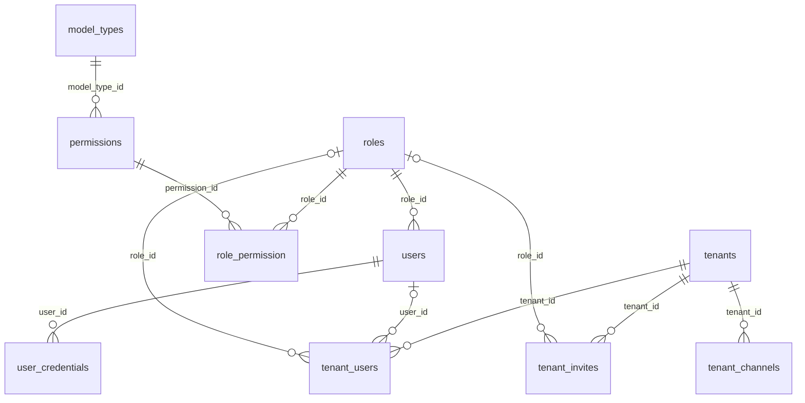
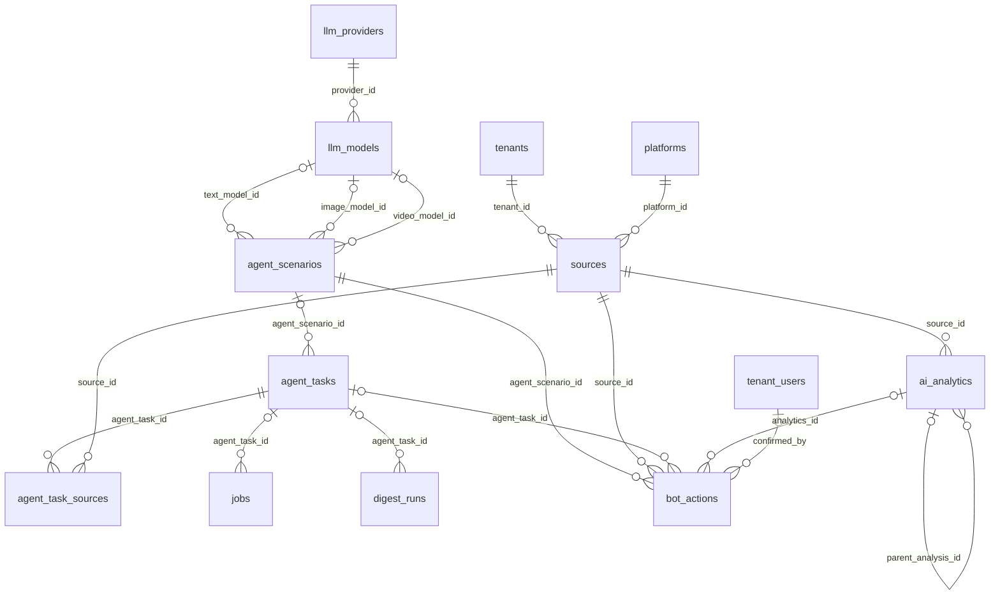
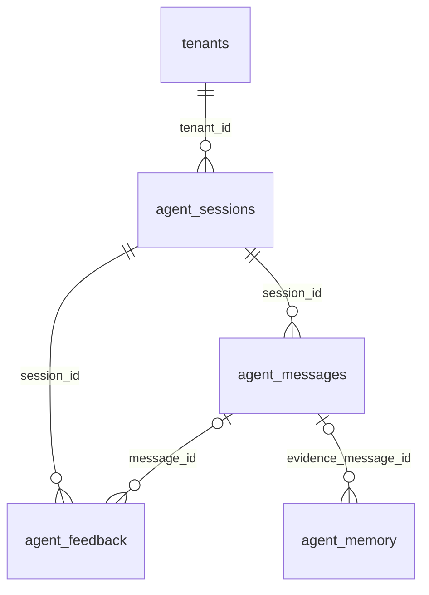

# Data Model Reference

Reconciled against dev `234a23dd7d1d2ce8dd3813f1ed63c7c7ef748669` on 2026-10-09 by inspecting the ORM model definitions, BaseManager and revisions 0086/0087. This is a source reference, not an inspection of a running database or a certification of every historical migration. Schema comes from `settings.DB_SCHEMA`; do not hardcode it in application code.

All current model tables and both association tables are indexed below. Field inventories omit inherited fields where indicated. Exact SQLAlchemy declarations, defaults and nullability remain linked at each table; the critical mismatches in the previous reference are corrected explicitly. For deployment state use Alembic in the target environment. For retry activation and work in review use [IMPLEMENTATION_STATUS](IMPLEMENTATION_STATUS.md), not this schema reference.

## Base classes and isolation boundaries

[Source: base.py](../app/models/base.py), [BaseManager](../app/models/managers/base_manager.py).

- `Base` supplies schema-aware metadata and a class-level manager placeholder. It does not define generic instance `save()`/`delete()` methods; specialized models may define their own methods.
- `TimestampMixin` supplies non-null `created_at` and `updated_at`, `DateTime(timezone=True)`, server default `now()`; `updated_at` also has SQLAlchemy `onupdate=now()`.
- `TenantScopedMixin` supplies non-null `tenant_id` FK → `tenants.id`, `ON DELETE CASCADE`, and the `__tenant_scoped__` marker. It does not itself enforce query authorization.
- Normal BaseManager querysets apply tenant criteria and fail without context for marked models; create rejects mismatched tenants. Explicit bypass, caller-built/raw SQL and association helpers require separate authorization. This is not automatic PostgreSQL row-level security or a guarantee that every direct SQL path is safe.
- `Tenant`, `TenantUser`, `TenantInvite`, `TenantChannel` do not inherit the marker, even though the latter three contain workspace FKs. Their managers/callers must enforce ownership explicitly. The tenant row itself has no `tenant_id`.

## Global catalog and identity tables

Timestamp fields apply to every table in this section except `platforms` and `role_permission`.

### `platforms`

[Source](../app/models/platform.py). Fields: `id` PK; `name` String(50), unique/non-null; `platform_type` native enum; `base_url` String(255), non-null; `params` JSON, non-null, default dict; `is_active` nullable Boolean, default true. No rate-limit columns, `created_at` or `updated_at` are declared. Reverse relationship: `sources`.

### `roles`

[Source](../app/models/role.py). Fields: `id` PK; `name` String(100), unique/non-null; `codename` native `user_role_type` enum stored as names; `description` nullable Text. Relationships: one role → many users; permissions through **`role_permission`**, not `permissions_roles`.

### `role_permission`

[Source](../app/models/role.py). Composite PK (`role_id`, `permission_id`), both FK columns to roles/permissions. No timestamps or tenant column. Association updates are not tenant-scoped queryset operations.

### `model_types`

[Source](../app/models/model_type.py). Application model metadata, NOT the LLM capability enum. Fields: `id` PK; `app_name`, `model_name`, `table_name` String(100), non-null; `description` nullable Text; `is_managed` Boolean, default true. Reverse relationship: permissions.

### `permissions`

[Source](../app/models/permission.py). Fields: `id` PK; `codename` String(100), non-null; `name` String(200), non-null; `action_type` native enum stored as names; `model_type_id` FK → model_types. `model_type` is an ORM relationship, not a String column. Unique (`codename`, `model_type_id`); model declaration also contains a codename-format CHECK. Python validation and historical stored codenames are not proof of deployed CHECK behavior; permission checks use structured model/action data.

### `users`

[Source](../app/models/user.py). Fields: `id` PK; `username` String(50) and `email` String(100), each unique/indexed/non-null; `hashed_password` String(255); `is_active` Boolean; nullable `is_superuser` Boolean; non-null `role_id` FK → roles. No `notifications` relationship is declared on User. Platform operator identity and workspace membership are separate concepts.

### `llm_providers`

[Source](../app/models/llm_provider.py). Fields: `id` PK; `name` String(255), unique/non-null; `description` nullable Text; `api_format` String(20), non-null/default `openai`; `base_url` String(500), non-null; `auth_header` nullable String(200); `encrypted_api_key` nullable Text; `is_active`, `is_default` Boolean. Relationship: models. Secret accessor is **`get_api_key()`**, masked display `decrypted_key_masked()`; never log plaintext. Global fleet; no tenant override or private-device route in this table.

### `llm_models`

[Source](../app/models/llm_model.py).

| Column group | Declaration / meaning |
| --- | --- |
| `id`, `provider_id` | Integer PK; non-null indexed provider FK, CASCADE |
| `name`, `model_id`, `description` | String(100), String(100), nullable Text |
| `model_type` | String(20), default text; `capabilities` is computed by splitting commas, not a column/native capability enum |
| `custom_endpoint_path` | Nullable **String(200)**, added by 0086 |
| `input_cost_per_1k`, `output_cost_per_1k` | Non-null Float, default 0; configured USD per 1K tokens |
| `last_request_cost`, `last_request_cost_at` | Nullable Float and timezone-unspecified DateTime |
| `last_used_at`, `last_success_at`, `last_error_at` | Nullable timezone-unspecified DateTime |
| `use_count`, `fail_count` | Non-null Integer, default/server default 0 |
| `max_tokens`, `default_temperature` | Non-null Integer default 4096; Float default 0.3 |
| `is_active`, `is_default` | Boolean defaults true/false |

Relationships: provider and text/image/video scenario model references. `is_default` is a Boolean, not a unique DB constraint per capability; manager/admin behavior must be reviewed separately. API-supported formats/capabilities and fallback behavior are client/schema contracts, not validated merely by these String columns. Do not assume API compatibility means tenant-private/local model routing is implemented.

## Workspace and personal credential tables

All tables in this section have TimestampMixin. The tables are not marked with TenantScopedMixin.

### `tenants`

[Source](../app/models/tenant.py). Fields: `id`, `name` String(100), unique `slug` String(50), `plan` **String(20), default `pro`**, `timezone` String(50), `is_active`, `daily_cost_limit` Float(default 5), `max_sources` Integer(default 20), nullable `agent_style` JSON, `agent_model` String(100), `agent_max_tokens` Integer(default 1024), `agent_temperature` Float(default 0.3), `agent_system_prompt` Text.

Declared CHECK allows **starter/pro/business**; `personal` is historical, migrated in 0071. `PLAN_LIMITS` is a class-level policy, not a table. `effective_limits()` takes min(column override, finite tier ceiling); unlimited business ceilings ignore those column overrides. Source budgets/features/retention policy declarations do not demonstrate complete spend accounting or cleanup.

### `tenant_users`

[Source](../app/models/tenant.py). Fields: `id`; non-null `tenant_id` FK CASCADE; `channel` String(20) (includes web membership); `external_user_id` String(100); nullable `user_id` FK → users CASCADE; nullable `role_id` FK → roles SET NULL; `is_active`. Unique (`tenant_id`, `channel`, `external_user_id`); PostgreSQL partial unique index (`tenant_id`, `user_id`) where user_id IS NOT NULL. Current `is_owner` treats null role_id as legacy owner; describe this compatibility behavior without recommending it as the future fail-closed policy.

### `tenant_invites`

[Source](../app/models/tenant.py). **Workspace-owned**, not an unowned global invite. Fields: `id`; non-null `tenant_id` FK CASCADE; unique `code_hash` String(64); nullable `role_id` FK SET NULL; nullable `expires_at` timezone-aware DateTime; `max_uses` Integer(default 1), `used_count` Integer(default 0), `is_active` Boolean(default true).

### `tenant_channels`

[Source](../app/models/tenant.py). Fields: `id`, non-null `tenant_id` FK CASCADE; `channel` String(20), `chat_id` String(100), `kind` String(20, default private); Boolean `is_digest_target` default false and `is_active` default true. Unique **(`channel`, `chat_id`)** globally; the same chat is not bound independently to multiple workspaces.

### `user_credentials`

[Source](../app/models/user_credential.py). Personal vault: `id`; non-null `user_id` FK → users CASCADE; `platform`, `kind` String(30); nullable `label` String(100); non-null `secret_encrypted` Text; nullable `expires_at` timezone-aware DateTime and `meta` JSON; `is_active` default true. Indexes on user_id and (user_id, platform). No tenant_id. Membership/owner resolution is required before workspace use; global storage is not unrestricted shared access. `reveal()` decrypts the secret; deployment/application secrets stay in configuration.

## Tenant-scoped collection and analysis

Every table below inherits tenant_id and timestamps.

### `sources`

[Source](../app/models/source.py). Fields: `id`; non-null `platform_id` FK CASCADE; `name` String(255); native `source_type` enum; `external_id` String(100); `params` JSON; `is_active`; nullable `last_checked` timezone-aware DateTime and `last_item_id` String(100).

Unique **(`tenant_id`, `platform_id`, `external_id`)**. There is **no `user_id` or scenario FK**. Token owner selection uses params/personal-vault resolution, not a nonexistent owner column. Relationships: platform, tenant, analytics; tasks through association table. Task selects scenario, with workspace default for taskless runs.

### `collected_items`

[Source](../app/models/collected_item.py). Previously missing from this reference. Fields: `id`; nullable `run_id` Integer; non-null `source_id` Integer; nullable `external_id` String(255); non-null `content_hash` String(64); nullable `platform` String(50), `published_at` timezone-aware DateTime, `media_type` String(20), `text` Text, `metrics`/`author` JSON, `permalink` String(500); non-null `analyze_attempts` default 0 and `give_up_after_attempts` default 3.

**source_id and run_id are logical references, NOT declared FKs.** Unique non-partial index (`source_id`, `external_id`); multiple NULL external IDs remain legal in PostgreSQL. Other indexes: tenant, source/hash, run, source/published. A failed analysis is not evidence that raw content can be deleted; actual retention/cleanup belongs to runtime policy.

### `agent_scenarios`

[Source](../app/models/agent_scenario.py). Fields: `id`, `name` String(255); nullable `description`, `base_prompt`, `summary_prompt` Text; nullable `content_types`, `analysis_types`, `scope`, `media_overrides`, `output_schema` JSON; nullable `max_tokens` Integer; `is_active` Boolean; non-null `is_default` Boolean default false; nullable `text_llm_model_id`, `image_llm_model_id`, `video_llm_model_id` FKs SET NULL; nullable native `llm_strategy` enum. `ai_prompt` is a compatibility property, not a column.

Methodology belongs here; schedule, source selection, triggers and approval guards belong to tasks. `analyze_type` was removed in 0083; do not draw a direct Source→Scenario FK. Query grouping is not a stored scenario field.

### `ai_analytics`

[Source](../app/models/ai_analytics.py). Fields: `id`; non-null `source_id` FK CASCADE; nullable `analysis_date` **Date**; non-null native `period_type` enum; nullable `content_hash` String(64); nullable `topic_chain_id` String(100), `chain_label`/`normalized_label` String(255); nullable `parent_analysis_id` self-FK SET NULL; non-null `summary_data` JSON; nullable `response_payload`, `main_topics`, `media_types` JSON; nullable `prompt_text` Text, `llm_model`/`provider_type` String(100), `request_tokens`/`response_tokens` Integer, `estimated_cost` Numeric(14,6).

Cost unit is **USD cents**, unlike USD Float columns elsewhere. NULL cost does not prove zero spend. Unique (`source_id`, `analysis_date`, `period_type`); indexed source, date, chain, source/hash and tenant. No provider_type index is declared here. LLM/model strings are historical attribution, not provider/model FKs. Relationships: source and parent/children.

## Tenant-scoped scheduling and delivery

Every table below inherits tenant_id and timestamps, except agent_task_sources.

### `agent_tasks`

[Source](../app/models/agent_task.py). Fields: `id`, `name` String(100), `cron_expr` String(100), `job_type` String(20), `payload` JSON; `is_active`; nullable `next_run_at`/`last_run_at` timezone-aware DateTime, `last_status` String(20), `last_error` Text; nullable native `trigger_type`/`action_type` enums and `trigger_config` JSON; nullable `rate_limit_per_hour`/`cooldown_seconds` Integer; non-null `requires_approval` Boolean default true; nullable `blacklist`/`whitelist` JSON; nullable `agent_scenario_id` FK SET NULL.

Unique (`tenant_id`, `name`); relationships: tenant, scenario, sources through association. job_type/payload and textual last_status are application contracts, not DB enums. See [task reference](AGENT_TASKS.md) for supported operations.

### `agent_task_sources`

[Source](../app/models/agent_task.py). Composite PK (`agent_task_id`, `source_id`), both FK CASCADE. No tenant_id/timestamps. Caller must validate both endpoints belong to the allowed workspace. Empty source assignment means all active sources according to task behavior, not a database constraint.

### `jobs`

[Source](../app/models/job.py). Fields: `id`; nullable `agent_task_id` FK SET NULL; non-null `job_type` String(20), `payload` JSON, **`status` String(20)** (not enum); non-null `run_at` timezone-aware DateTime; nullable `locked_at`, **`started_at`, `finished_at`** timezone-aware DateTime; non-null `attempts` Integer(default 0), `max_attempts` Integer(settings default, server default 3); nullable `result` JSON, `error` Text, `llm_cost` Float **USD**. Indexes: tenant, (status, run_at), agent_task_id. NULL cost is none/unknown, not guaranteed zero. Queue claims do not establish distributed connector leases.

### `digest_runs`

[Source](../app/models/digest_run.py).

| Column | Declaration |
| --- | --- |
| `id`, `agent_task_id` | Integer PK; nullable task FK SET NULL |
| `period` | Non-null String(10); not a DB enum. Supported periods are caller contracts |
| `period_start`, `period_end` | Non-null **Date**, not DateTime |
| `channel`, `chat_id` | Non-null String(20); nullable String(100) |
| `status` | Non-null **String(20)**, default pending; not native enum |
| `message_id` | Nullable String(100) |
| `content`, `error` | Nullable Text |
| `delivery_state` | Nullable JSON, **JSONB on PostgreSQL**, migration 0087 |
| `llm_cost` | Nullable Float, **USD**, none/unknown allowed |

Unique (`agent_task_id`, `period_start`, `period_end`); nullable task FK means manual runs are not uniquely constrained as scheduled runs are. There is **no `results` JSON column**. Nullable checkpoint history must not be interpreted as definitely unsent. Merged storage/contract/store/parts/transport helpers do not mean the builder activates retry delivery; PR #12's atomic factory is in review at this baseline.

### `notifications`

[Source](../app/models/notification.py). Fields: `id`, `title` **String(200)**, `message` Text, native `notification_type` enum stored as names, `is_read` Boolean(default false), `related_entity_type` String(50), `related_entity_id` Integer. Related entity fields are generic attribution, not FKs. Source of allowed notification types: [enum definitions](../app/types/enums/). Workspace notifications and fixed operator alerts have different transport/security paths; see [NOTIFICATIONS](NOTIFICATIONS.md).

## Tenant-scoped conversation, memory and action audit

All tables here inherit tenant_id/timestamps.

### `agent_sessions`

[Source](../app/models/agent_session.py). Fields: `id`, `channel` String(20), `chat_id` String(100); `kind` String(20, default private); `is_owner` false, `is_active` true; nullable `state` JSON, `last_message_at` timezone-aware DateTime. Unique **(`channel`, `chat_id`)**, not (tenant_id, channel, chat_id). `update_offset`/`pending_confirmation` are properties derived from state. Session ownership is not a substitute for current user/operation authorization.

### `agent_messages`

[Source](../app/models/agent_message.py). Fields: `id`; non-null `session_id` FK CASCADE; **`role` String(20)**, not enum; nullable `content` Text, `tool_calls` JSON, **`tool_name` String(64)**, `tokens` Integer, `cost` Float USD. No `tool_outputs` column. Tool result content is stored through the message contract. Indexes: tenant and session.

### `agent_memory`

[Source](../app/models/agent_memory.py). Fields: `id`; `scope` **String(20)** default global; `key` String(100); nullable `value` Text; `source` String(20) default manual; `confidence` Float default 1; nullable `evidence_message_id` FK → messages SET NULL. Unique (tenant_id, scope, key). No declared CHECK bounds confidence to 0.1–1.0. Small durable preferences/facts, not a vector store or business-case ledger.

### `agent_feedback`

[Source](../app/models/agent_feedback.py). Fields: `id`; non-null `session_id` FK CASCADE; nullable `message_id` FK SET NULL; **`vote` String(10)**, not enum; nullable `note` Text, `voter_channel` String(20), `voter_external_id` String(100). Indexes: tenant, session, vote. Feedback itself does not mutate prompts.

### `bot_actions`

[Source](../app/models/bot_action.py). Fields: `id`; non-null `agent_scenario_id` and `source_id` FKs CASCADE; nullable **`agent_task_id`, `analytics_id`** FKs SET NULL; native `action_type` and `status` enums stored as names; non-null `payload` JSON; nullable **`result` JSON** and `error` Text; non-null **`dry_run` Boolean(default true)**; nullable **`confirmed_by` FK → tenant_users SET NULL**, `confirmed_at` timezone-aware DateTime; non-null `attempts` default 0. No `approved_by` String column. Enum status and dry_run are separate, not a manufactured dry_run enum value. Confirmation columns alone do not prove complete actor-bound approval/replay safety.

## ER views from declared foreign keys

Views are intentionally split for readability. Common tenant FKs and some fields are omitted; nullable parent FKs use o|. Arrows do not guarantee equal tenant IDs across endpoints: source FKs are not composite tenant-identity constraints. Logical references are noted separately, never invented as FKs.

### Identity and membership

### Collection, scenarios, scheduling and actions

Model arrows labeled text/image/video_model_id abbreviate the actual text/image/video_llm_model_id columns. collected_items.source_id/run_id are soft references, deliberately omitted from the FK graph. No direct Source→Scenario or Scenario→Analytics FK exists.

### Conversations and provenance

## Migration history and deployment

Selected milestones, not a complete replay audit:

| Revision | Change |
| --- | --- |
| 0031 / 0060 | Analytics cost tracking / sub-cent Numeric precision |
| 0041 / 0042 / 0043 | Task queue / digest runs / agent tables |
| 0044 | Tenancy foundation |
| 0049 | Analytics content hash |
| 0053 | Remove platform rate-limit columns |
| 0061 | Remove source user ownership column |
| 0063 | Task/source association |
| 0065 / 0066 | Personal vault / remove tenant credential table |
| 0067 | Remove source scenario FK |
| 0068 / 0075 / 0082 | Raw staging / attempts / non-partial dedup index |
| 0071 | Starter/pro/business tiers |
| 0073 / 0076 | Task-owned actions / scenario prompt simplification |
| 0077 / 0078 | Workspace chat settings / job execution timestamps |
| 0080 / 0081 | Membership role FK / chain labels |
| 0083 / 0084 / 0085 | Remove scenario analyze_type / fleet usage / normalized labels |
| 0086 | Nullable custom_endpoint_path String(200) |
| **0087** | Nullable digest delivery_state JSONB; down_revision **0086** |

Latest inspected repository revision is **0087**, replacing the stale head-0086 statement. [0086](../migrations/versions/0086_add_custom_endpoint_path_to_llm_models.py) points to 0085; [0087](../migrations/versions/0087_add_digest_delivery_state.py) points to 0086. Full graph resolution (`alembic heads`), metadata drift (`alembic check`) and deployed version (`alembic current`) were NOT executed in this documentation task.

Apply migration 0087 before starting updated ORM code against a target database; merge is not deployment. Existing NULL states have no invented receipts. Dropping the checkpoint field destroys delivery evidence: pause senders and retain evidence before an approved downgrade. See [schema review](design/digest_delivery_state_schema_review.md).

Verification scope, differences and continuation: [model reference reconciliation](design/archive/model_reference_reconciliation_handoff.md).
