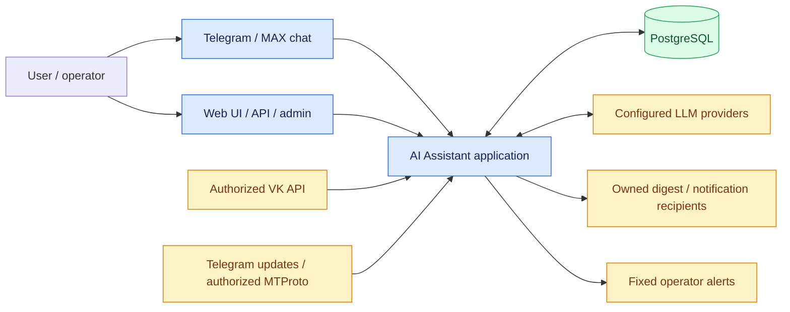
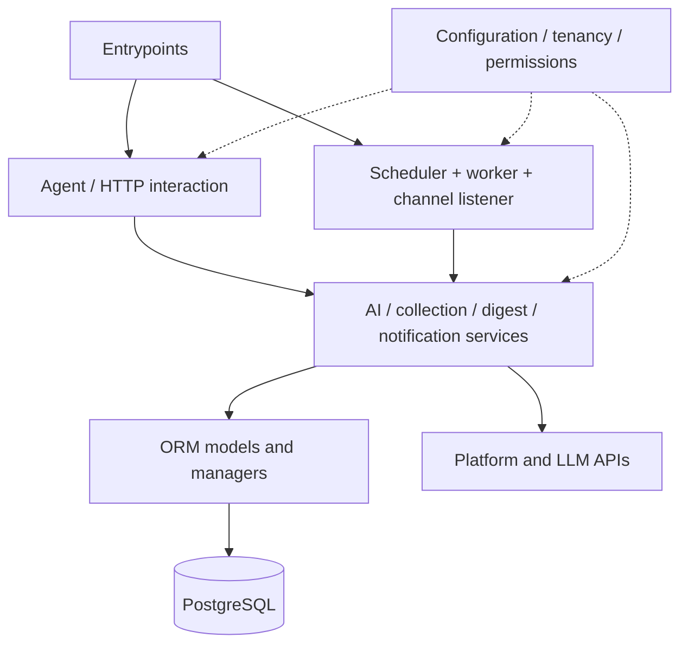
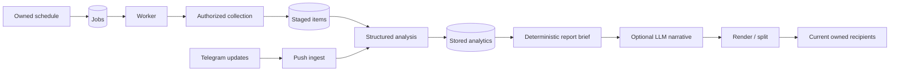
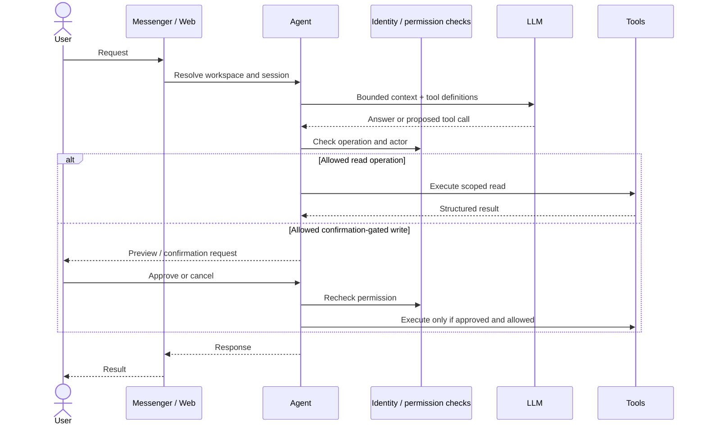
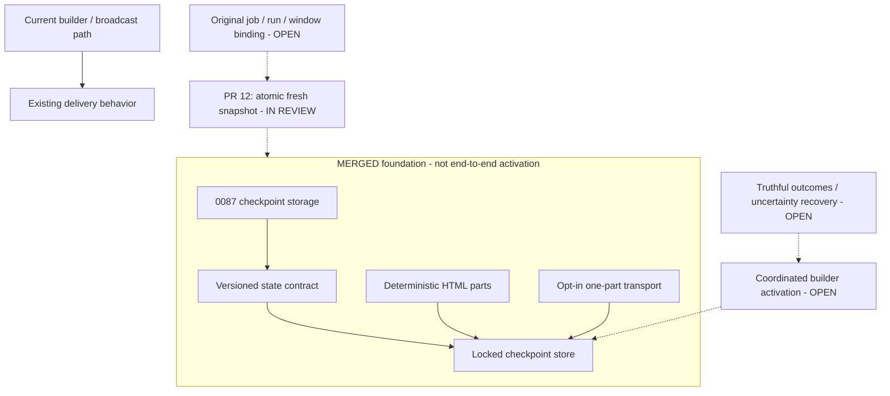
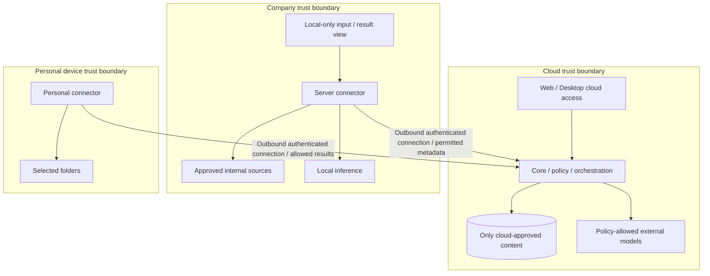

# Project map: current runtime and planned expansion

Baseline: dev `234a23dd7d1d2ce8dd3813f1ed63c7c7ef748669`, inspected 2026-10-09. Diagrams are explanatory views, not deployed-state evidence or complete dependency/FK graphs. Current views and separately labeled planned views prevent a roadmap being mistaken for shipped features. See [documentation index](DOCS_INDEX.md) and [status rules](DOCUMENTATION_GUIDE.md).

## 1. Current system context

MAX transport is not MAX collection. Recipients must be owned/authorized; operator alerts cannot carry arbitrary customer reports. Tenant isolation, complete cost admission and production readiness still have open gates.

## 2. Repository map and responsibility

| Path | Responsibility | Read next |
| --- | --- | --- |
| `app/runtime.py`, `app/worker.py` | Combined runtime and worker entrypoints | [Tasks](AGENT_TASKS.md) |
| `app/main.py`, `app/web/`, `app/api/`, `app/admin/` | Optional HTTP surfaces and UI | [API](API.md), [Admin](ADMIN.md) |
| `app/agent/` | Interactive tools, sessions, prompts and memory | [Agent](AGENT.md) |
| `app/tasks/`, `app/jobs/` | Scheduling, queue claiming and job handlers | [Tasks](AGENT_TASKS.md) |
| `app/channels/` | Messenger listener and outbound transports | [Channels](CHANNELS.md) |
| `app/services/social/`, `app/services/monitoring/` | Credentials, platform clients, pull collection and push ingest | [Collection](COLLECTION.md) |
| `app/services/ai/` | Analysis, prompt/schema assembly, reporting and model orchestration | [AI pipeline](AI_PIPELINE_AND_PROMPTS.md) |
| `app/services/digest/` | Digest build/render and delivery checkpoint components | [Digest](DIGEST.md) |
| `app/services/tenancy/`, `app/core/` | Workspace context, configuration, DB/security foundations | [Tenancy](TENANCY.md) |
| `app/models/`, `app/schemas/` | ORM, managers and typed contracts | [Models](MODELS.md) |
| `app/services/notifications/` | Workspace notifications and operator alert separation | [Notifications](NOTIFICATIONS.md) |
| `app/templates/`, `app/static/` | Web assets and templates | [UI design](design/ui.md) |
| `cli/`, `scripts/` | Operator commands and setup/test utilities | [CLI](CLI.md) |
| `migrations/`, `tests/`, `docker/` | Schema history, regression checks and deployment assets | [Deployment](DEPLOYMENT.md) |
| `app/celery/` | Frozen legacy; not the active runtime architecture | Root guidance |

No nonexistent `app/services/llm/` directory is introduced in this map: the inspected services directory contains `ai`, not a dedicated `llm` directory. Recheck older guidance against actual source paths before navigating or editing.

This is a responsibility view; arrows do not certify every import or authorization path.

## 3. Current collection and report flow

Pull staging and Telegram push ingest have different paths; do not infer every pushed item uses the identical job staging lifecycle. Scenario defines analysis methodology; task selects sources/schedule/reaction; grouping is a report projection. Evidence and metric coverage depend on actual source capabilities.

## 4. Agent interaction sequence

Conceptual happy path, not proof of complete fail-closed identity or actor/TTL-bound approval. Those remain readiness work; rejected operations must not execute.

## 5. Delivery: merged components versus inactive integration

At the inspected baseline PR #12 is draft/open (`91a4ab1`), not merged. Its reported 250 focused passes are the other task's evidence, not checks rerun by this documentation task. Merged foundation does not mean deployed migration or active retries. Latest work-in-review checklist is on that PR branch; merged status is [IMPLEMENTATION_STATUS](IMPLEMENTATION_STATUS.md). Do not duplicate receipt fields into a future general-purpose outbox without a separate design.

## 6. Proposed cloud/hybrid topology - NOT IMPLEMENTED

One connector engine, personal/server profiles; no customer server required for direct cloud use. Local-only content, including prompts/results, must not pass through cloud chat. There is no automatic external model fallback. Autonomous core placement is a later stage. Detailed policies and acceptance: [DEPLOYMENT_ARCHITECTURE](DEPLOYMENT_ARCHITECTURE.md).

## Maintenance

Keep this map high-level and link to authoritative contracts rather than copy their field lists. Change diagrams with the corresponding behavior change; label baseline, active versus opt-in versus proposed status and verification limits. Mermaid source is versioned and rendered by GitHub; diagram parsing/rendering must be checked during PR review. This task does not implement these future components or certify the current deployment.
