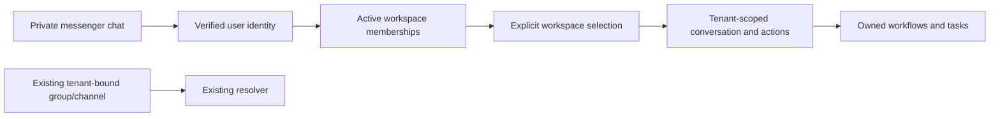

# Personal chat as a user entry point

Status: proposed implementation contract, not implemented or activated.
Baseline: dev 72a57cb, after PR #12. The fixture correction is a separate change;
it does not introduce personal-account routing or require a migration.

## Immediate schema decision

Keep `TenantChannel.uq_tenant_channel_chat` on `(channel, chat_id)` while the
current inbound resolver identifies one workspace by that pair. Adding
`tenant_id` to that constraint alone is not a personal-chat implementation.
The owner's locally generated revision 0088 is not present in this baseline.
Confirm whether it was applied before choosing recovery steps or allocating
another Alembic revision. Never stamp away an applied migration or delete
bindings automatically to make a downgrade succeed. Use the configured schema,
not a hardcoded `public`, for any eventual schema work.

The digest integration fixtures previously reused `chat_id="one"` across two
workspaces. Correct the fixtures, not the production uniqueness rule. Each
binding now gets an isolated destination; simulated transports use returned
binding identifiers. A regression checks the ORM constraint and another checks
that PostgreSQL rejects a duplicate chat across workspaces.

## Product contract

One private messenger chat can be an authenticated user's entry point to
multiple workflows. Workflows are not tenants. Multiple AgentTasks already can
belong to one tenant; this does not require sharing a chat across tenants.
For multiple workspaces, the user's active membership and explicit selected
context decide what can be accessed. Workflow selection must reference an
owned task, not create another parallel execution engine.

## Identity and linking

- Add a dedicated private-chat/account binding rather than repurposing
  `tenant_channels` as both account identity and workspace destination.
- A private chat has one verified account owner. Check both the sender's
  provider user identifier and private-chat kind on every inbound message.
  A chat identifier, username or email string alone is not account proof.
- Connect a messenger identity to an authenticated web account using a
  short-lived, single-use challenge consumed atomically. Protect against
  replay, expiry, concurrent consumption and linking an already owned chat.
- Intercept linking commands before agent logging/history; do not persist or
  log the plaintext challenge as conversation content.
- Do not automatically attach existing messenger memberships to a web user by
  numeric identifier coincidence, display name or a nullable role.
- Existing deployments use one bot per channel. Define connection-aware
  address identity before supporting multiple bots; do not silently assume
  two bot destinations are the same chat.

## Workspace context and authorization

- List only active memberships in active workspaces for the authenticated user.
- With multiple accessible workspaces and no valid selection, ask for explicit
  selection; never guess the first row or infer a workspace through an LLM.
- Validate membership and action permissions on every request, including after
  workspace selection. Missing/unresolved role information grants no new
  personal-routing privilege.
- Keep conversation state, memory, history and cached results separated by
  workspace as well as chat/user. Switching context does not copy history.
- A revoked membership invalidates selection immediately. Background jobs use
  their recorded tenant/task, never the chat's current selected workspace.
- Reject foreign task/source identifiers before aggregation, model invocation,
  enqueue or HTTP. Serialize selection changes or use versioned context so
  a concurrent command cannot execute in an unintended workspace.
- Leave group chats and channels on the existing tenant-bound route initially.
  Do not equate a group with one account owner.

## Delivery boundaries

Initial personal-routing implementation covers private commands, workspace
selection, workflow management and replies. Existing scheduled digest targets
remain on the current checkpoint contract and current tenant binding checks.
Do not reinterpret or rewrite stored generations/receipts during migration.

Cross-workspace scheduled notifications to one personal chat require explicit
per-workspace subscriptions and current membership authorization before send.
That extension must define a versioned frozen recipient contract, revocation,
workspace labeling and recovery behavior before becoming a producer. Selecting
another workspace must never reroute already enqueued delivery.

## Implementation sequence

1. Correct digest test fixtures and test the existing global chat invariant.
2. Resolve the owner's local model/migration divergence and run the digest
   regression suite against a dedicated disposable database/schema.
3. Implement account linking and private-chat ownership with additive schema,
   schema-aware migrations and isolated PostgreSQL tests. Existing routes stay
   unchanged until the new route is explicitly enabled.
4. Integrate deterministic workspace selection, per-action authorization and
   tenant-separated agent sessions. Add mocked Telegram/MAX end-to-end cases.
5. Add explicit personal notification subscriptions as a distinct delivery
   change, preserving the checkpoint/no-blind-replay rules.

Every implementation unit is a small PR based on fresh dev. Merging, applying
migrations and activation are separate actions; a plan or prepared test is not
an executed acceptance test. No database mutation or feature activation is
performed by this document.

## Required acceptance matrix

- One private chat, one verified user, several workflows in one workspace.
- Several permitted workspaces with explicit switching; no history leakage.
- Unknown sender, non-private chat and attempted account-link takeover denied.
- Expired/replayed link token and competing consumers cannot bind twice.
- Forged workspace/task/source IDs denied before any LLM or transport call.
- Inactive account/workspace, revoked membership and unresolved role denied.
- Simultaneous selection and action do not change an in-progress job's tenant.
- Scheduled jobs keep the original tenant after chat context changes.
- Existing group/channel routing and digest retries remain unchanged when the
  new route is off. No fallback turns an ambiguous private route into access.
- Schema upgrade and rollback tested with configured non-public test schemas;
  collision handling is explicit and does not delete user data.
- Telegram/MAX transports and LLM are mocked; tests never send live messages.
