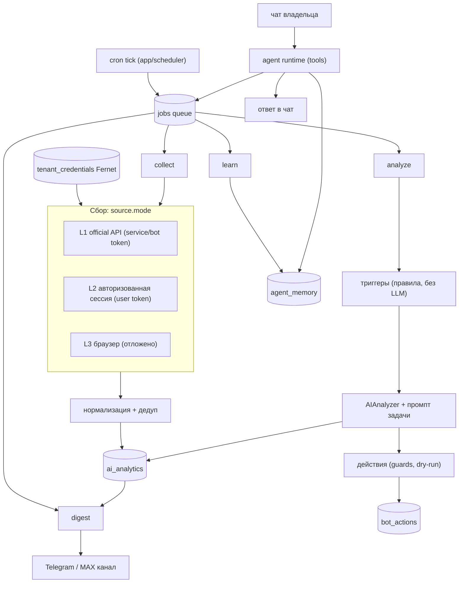

# Видение продукта: персональный AI-агент для соцсетей

Один процесс (`python -m app.runtime`) — cron-планировщик, воркер задач и
long-polling чат-ботов. Владелец общается с агентом в личном чате Telegram/MAX,
получает дайджесты в канал и управляет источниками, расписаниями и задачами
обычными сообщениями.

**Главный принцип: агент — тонкий слой над детерминированным пайплайном.**
Данные собирает и анализирует конвейер (`cron → jobs → collect → analyze →
digest`), а LLM вызывается только там, где нужен смысл: классификация, резюме,
черновик ответа, разговор с владельцем. Планировщик из LLM («модель решает,
какие шаги выполнить») сознательно не используется: он дорогой, нестабильный и
ломает лимиты, идемпотентность и предсказуемость.

Этот файл — целевое состояние и что осознанно не делаем. Реализованные детали
здесь не дублируются: см. `docs/DOCS_INDEX.md`.

---

## 1. Что уже работает

| Контур | Что умеет | Где смотреть |
|---|---|---|
| Планировщик и очередь | cron → `agent_tasks`, очередь `jobs` на Postgres (`FOR UPDATE SKIP LOCKED`), ретраи, reap | `docs/AGENT_TASKS.md` |
| Каналы | Telegram/MAX: long polling + отправка, split длинных сообщений | `app/channels/` |
| Агент в чате | tool calling, сессии, транскрипт, KV-память, подтверждения опасных действий, суточный лимит расходов | `docs/AGENT.md` |
| Дайджесты | агрегация за день/неделю, LLM-саммари, доставка в канал, идемпотентность | `docs/DIGEST.md` |
| Мультитенантность | один бот — много рабочих пространств, инвайт-коды, изоляция на уровне менеджеров | `docs/TENANCY.md` |
| Анализ контента | `AIAnalyzer` + `BotScenario` (text/image/video/audio/unified промпты, scope, JSON-схема) | `docs/guide/AI_PIPELINE_AND_PROMPTS.md` |
| LLM-провайдеры | конфигурация в БД, OpenAI-совместимые и Anthropic, fallback, учёт стоимости, тест подключения в админке | `AGENTS.md` |
| Сбор контента | VK по API, Telegram по Bot API (L1) и по MTProto-сессии (L2); слой выбирается на источнике, дедуп отсекает повторы до вызова LLM | `docs/COLLECTION.md` |
| Промпты задач | `TaskTemplate`: глобальный контракт + переопределение workspace, структурированный вывод, инструменты `task_*` | `docs/AGENT.md` |
| Действия бота | триггеры без LLM → черновик действия, guards, dry-run по умолчанию, леджер `bot_actions` | `docs/AGENT_TASKS.md` |
| Обучение в чате | факты с provenance, `/good` `/bad` `/memory clear`, фоновое извлечение предпочтений | `docs/AGENT.md` |

## 2. Целевая архитектура

Два независимых пути, связанных только через БД: **пайплайн** (без LLM-решений)
и **агент в чате** (управляет пайплайном, отвечает по данным, выполняет задачи
по промптам из админки, учится у владельца).

## 3. Гибридный сбор: API и авторизация (подход Hermes)

Три слоя, включаются на уровне источника (`Source.params["mode"]`), а не всей
системы: большинству источников достаточно первого, редким нужен второй.

| Слой | Как работает | Что требуется от владельца | Покрытие |
|---|---|---|---|
| **L1 official API** | service-токен VK, Bot API Telegram | токен; бот добавлен админом в канал/чат | открытые сообщества; чаты и каналы, где бот участник |
| **L2 user session** | VK user token (доступ к тому, что видит аккаунт владельца) | одноразовый ввод токена в админке/CLI | закрытые сообщества и стены |
| **L3 браузер** (отложено) | headless-браузер, парсинг страниц | разовая настройка сессии | «всё остальное», где API нет — последний рубеж, самый хрупкий |

Правила, которые не обсуждаются:

- Секреты живут только в `tenant_credentials` (Fernet, ключ `CREDENTIALS_KEY`
  из env). Env-переменные — устаревший fallback для single-tenant установок,
  основной путь — БД.
- **Агент и LLM никогда не видят plaintext**: инструментам доступно только
  «подключение работает / нет», платформа и срок жизни токена. Секрет не
  попадает ни в промпт, ни в лог, ни в чат.
- **MCP-сервер и внешний брокер авторизации не нужны**: своя БД, свои шифры,
  один оператор. Внешний сервис добавил бы зависимость без выгоды.
- **Ограничение Telegram:** Bot API не отдаёт историю канала или чата. Посты
  берутся из апдейтов, которые бот реально получает (`getUpdates`), а историческая
  глубина доступна только через L2 (MTProto user session) — отдельное решение с
  отдельной зависимостью и отдельным хранением сессии.
- **Ограничение VK:** OAuth-web ради read-only не нужен, device flow у VK нет —
  достаточно одноразового ручного ввода user token.
- Источник можно «выключить» мгновенно: истёк токен или платформа отвечает
  4xx — источник помечается нерабочим, пайплайн не падает целиком.

## 4. Промпты: где и для чего

| Сущность | Назначение | Ключевые поля | Где правится |
|---|---|---|---|
| `BotScenario` | **контракт анализа источника**: чем и как анализировать конкретный источник | `text_prompt`, `image_prompt`, `video_prompt`, `audio_prompt`, `unified_summary_prompt`, `analysis_types`, `scope` (JSON-схема), `trigger_type/config`, `action_type` | админка (уже реализовано) |
| `TaskTemplate` | **контракт задачи агента**: сводка, алерт, ответ в комментариях, исследование темы | `slug`, `purpose`, `system_prompt`, `user_prompt_template`, `output_schema`, модель/температура/лимит токенов, `tools` (allowlist), `requires_confirmation`, `cron_expr` | админка; из чата — только с подтверждением владельца (`docs/AGENT.md`) |

Порядок резолва у обоих — как у LLM-провайдеров: шаблон рабочего пространства →
глобальный default → дефолт в коде (`app/agent/prompts.py`,
`app/services/ai/prompts.py`). Пустая конфигурация обязана давать рабочий
результат, поэтому код-дефолт стоит в конце цепочки, а не в начале.

Промпты аналитики (per-media) и промпты задач (per-goal) — разные сущности: у
первых измеряется качество извлечения, у вторых — полезность результата.
Слияние сделало бы обе конфигурации непредсказуемыми; не сливаем.

## 5. Как агент «обучается» на диалоге

Дообучение модели недоступно и не нужно. Обучение = накопление знаний о
владельце и эволюция конфигурации, всё — с его подтверждением.

| Механизм | Как работает | Что даёт |
|---|---|---|
| Память с provenance | факты и предпочтения (`agent_memory`) получают источник (`manual` — сохранил сам агент, `learn` — извлечено из диалога), уверенность и ссылку на сообщение-доказательство | агент вспоминает контекст, а владелец видит, откуда факт взялся |
| Обратная связь | `/good`, `/bad <заметка>` после ответа; запись в журнал обратной связи | понятно, какие ответы были неверны и почему |
| Эволюция промптов | агент предлагает правку `TaskTemplate`/стиля, владелец подтверждает «да» — сохраняется новая ревизия | качество растёт без ручной перенастройки в админке |
| Стиль рабочего пространства | `agent_style` (тон, длина, язык, тихие часы) уходит в системный промпт | ответы и уведомления подстраиваются под владельца |

Обязательные ограничения: память видна и удаляема из чата (`/memory clear`),
`learn`-джоб не удваивает работу LLM (запускается после N сообщений или простоя),
персональные данные не уходят в общий глобальный профиль между workspace.

## 6. Автоматические действия и безопасность

Реакции (комментарии, ответы) выполняются тем же конвейером, но за жёсткими
правилами, и всегда с записью в леджер `bot_actions`:

- триггеры декларативные (`BotScenario.trigger_type/config`): ключевые слова,
  упоминания, порог тональности, всплеск активности — решает правило, не модель;
- guards перед отправкой: права модератора, лимит в час, cooldown, чёрный и
  белый списки;
- по умолчанию **dry-run**: вызов возвращает подготовленный payload, а не
  публикует его;
- рискованное действие уходит владельцу как запрос подтверждения в чат (тот же
  механизм, что для опасных инструментов агента);
- в леджере хранится результат и ошибка. Поля `attempts` / `confirmed_by` /
  `confirmed_at` заведены в модели, но пока не заполняются — прикручиваются
  вместе с реальной (не dry-run) публикацией.

## 7. Роадмап

| Этап | Содержание | Статус |
|---|---|---|
| M0–M3 | baseline, scheduler+jobs, каналы+дайджест, tenancy, агент-рантайм | сделано |
| M4 | деплой на VPS (prod compose, systemd, бэкапы) | ожидает |
| M5 | hardening: алерты, retention, бюджеты сбора и анализа | ожидает |
| M6 | гибридный сбор: волт кредов, VK user token, ingest Telegram Bot API, дедуп, MTProto L2 | сделано |
| M7 | промпты задач (`TaskTemplate`) + инструменты `task_*` у агента | сделано |
| M8 | триггеры → `bot_actions`, guards, write-клиенты (dry-run) | сделано частично: `analyze` создаёт действия, но расписание для него не создаётся автоматически и не принимается CLI/тулом агента (allowlist `collect`\|`digest`\|`prune`); автопубликации нет — только dry-run |
| M9 | обучение из чата: память с provenance, обратная связь, эволюция промптов | сделано |

Детали и ретроспективы по этапам — в `.agent/lessons/` и `.agent/index.md`
(локально, не в git).

## 8. Риски

| Риск | Митигация |
|---|---|
| Бан/лимиты соцсетей | rate limit и бэкофф на платформу, приоритет официальных API, минимум запросов за счёт дедупа |
| Telegram Bot API не даёт историю | честно фиксируем в докладе владельцу; история — только через L2-сессию |
| Перерасход на LLM | дедуп контента, триггеры до анализа, суточные лимиты на workspace и агента |
| Неудачная автоматическая реакция | dry-run по умолчанию, guards, подтверждение владельцем, полный леджер |
| Потеря доступа к источнику | источник отключается точечно, пайплайн и остальные источники продолжают работать |
| Дрейф документации | в доках — инварианты и указатели, а не значения; после каждой задачи свежесть фактов перепроверяется |

## 9. Метрики

- **Покрытие сбора**: доля активных источников, успешно обработанных за сутки.
- **Экономия**: доля контента, отсеянного триггерами и дедупом до вызова LLM.
- **Полезность**: доля дайджестов и ответов, помеченных владельцем как полезные.
- **Автономность**: доля действий, выполненных без ручного вмешательства владельца.

## Что осознанно не делаем

- LLM-планировщик вместо конвейера и «агент сам решает, что собрать».
- MCP-сервер и внешние брокеры авторизации.
- Fine-tuning моделей.
- Streamlit-дашборд, Celery/Redis как рабочий контур, RBAC-матрицу,
  Prometheus/Grafana — это замороженное наследие, не часть продукта.
- Хранение сырого контента: сохраняем только аналитику и метаданные.

